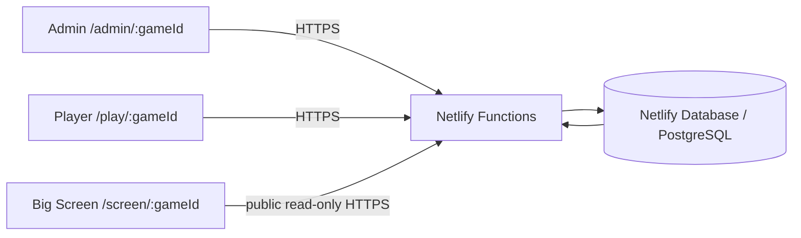
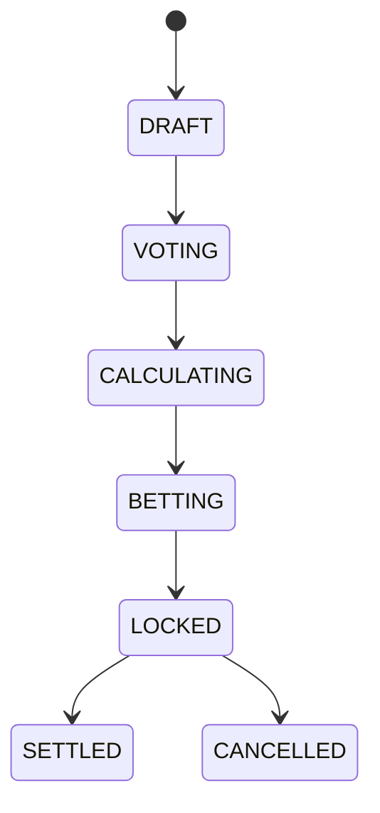

# Market Mayhem Architecture

Market Mayhem is a private game-night economy and prediction market. The physical games happen outside the app; the app maintains the money, markets, rounds, and broadcast state.

## System overview

All financially meaningful state lives in PostgreSQL. React state is presentation/cache only.

## Live-state architecture

Each client uses the same `PollingLiveStateProvider` pattern:

1. poll the tiny `game-version` endpoint;
2. compare the returned version with the last local version;
3. if unchanged, do nothing;
4. if changed, fetch one targeted snapshot for that interface;
5. after a successful local mutation, refresh immediately instead of waiting for the next poll.

Polling intervals live in **one file**: `src/config/live.ts`.

The browser Page Visibility API moves hidden tabs to a much slower interval. Polls are deduplicated: a second poll never starts while the previous poll is in flight. Stale requests are cancelled with `AbortController`.

This design is intentionally polling-based for v1 because it keeps Netlify Functions short-lived and avoids a separately hosted realtime server. The UI depends on a small live-state abstraction so it can be swapped later.

## Database and economy invariants

- `wallets.current_balance` is a cached balance.
- `ledger_entries` is the immutable audit history.
- Old financial rows are never edited to make history look different.
- Corrections are compensating ledger entries.
- Wallet-affecting writes execute inside a PostgreSQL transaction and lock the relevant wallet row.
- A wallet may never become negative.
- `wallet.current_balance` must equal `SUM(ledger_entries.amount)` for the player.
- Bet stakes are deducted at placement; successful settlement credits the complete return.
- Bet placement is one bet per player per prediction.
- Bet settlement is idempotent and protected by state locks plus unique ledger constraints.

## Prediction state machine

The browser never supplies an arbitrary next status. Each mutation endpoint validates the expected server-side current phase.

Voting stores a 0-100 YES probability per player. Closing voting calculates the arithmetic mean, derives NO as `1 - YES`, applies configurable probability clamps, and stores fixed decimal odds. Wager volume never changes those odds.

## Round architecture

Round number is a label and intended running order, not an execution dependency. Admin may start R07 while R04/R05 remain upcoming. Execution chronology is represented by timestamps, not `round_number + 1` logic.

Historical corrections can be attributed to any round without changing the currently active round.

## Authentication

### Players

Players do not create accounts. Admin generates a cryptographically random single-use join token. `/join/:token` exchanges it for an opaque session cookie backed by `player_sessions`. Raw session IDs are never stored; only SHA-256 hashes are stored in the database.

### Admin

Admin login is controlled by environment variables. Passwords are verified against a PBKDF2 hash generated by `npm run admin:hash`. Successful login creates an opaque server-side session in `admin_sessions` and sets an HttpOnly cookie.

## Public/private boundary

Big Screen reads only public-safe fields. Player state includes only the authenticated player's wallet, ledger, vote, and bets plus public market data. Admin state includes private notes, codewords, join controls, and audit data.

## Big Screen state

`screen_state` is explicit broadcast state. Admin actions set the mode and associated round/prediction. The screen never guesses which composition to show.

Supported modes:

- `DASHBOARD`
- `ROUND_STARTED`
- `PREDICTION_VOTING`
- `CROWD_REVEAL`
- `BETTING_OPEN`
- `PREDICTION_RESULT`

## Concurrency protection

Wallet rows and predictions are locked with `SELECT ... FOR UPDATE` during critical operations. Unique constraints prevent duplicate bets and duplicate bet ledger actions. Financial mutations accept idempotency keys where duplicate money movement is otherwise possible.

## Settlement algorithm

1. lock prediction;
2. return safely if already settled/cancelled;
3. verify prediction is `LOCKED`;
4. lock all bets;
5. for each winner: `round(stake * odds_snapshot)` and credit `BET_PAYOUT`;
6. for losers: no wallet credit;
7. for cancel: credit `BET_REFUND` equal to stake;
8. mark bets final;
9. mark prediction settled/cancelled;
10. set Big Screen result state;
11. increment global game version;
12. commit.

Any error rolls the whole operation back.

## Deployment

The repository is designed for GitHub continuous deployment to Netlify. `@netlify/database` is installed, and schema migrations live under `netlify/database/migrations/`. Netlify applies those migrations as part of deploys. No external Supabase/Firebase/VPS project is required.
