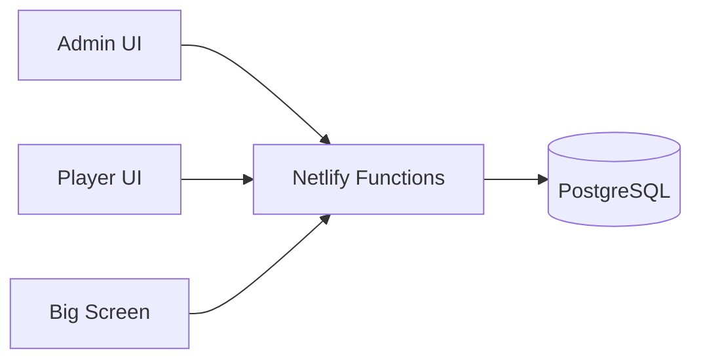
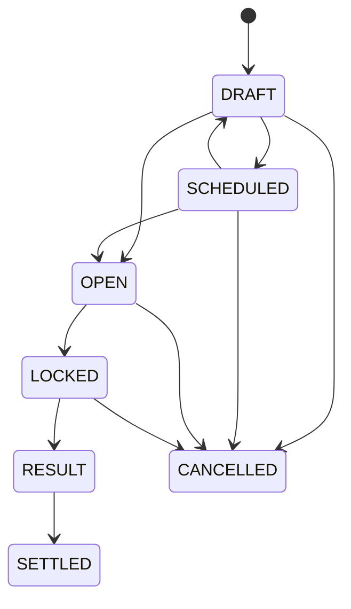
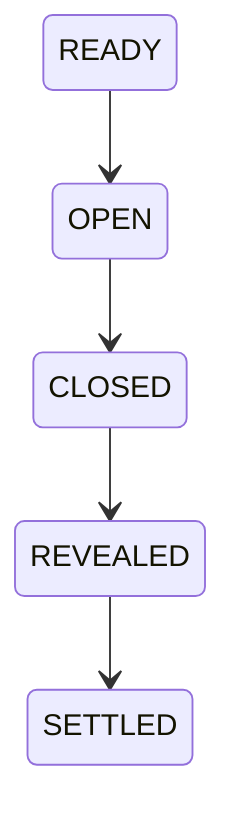
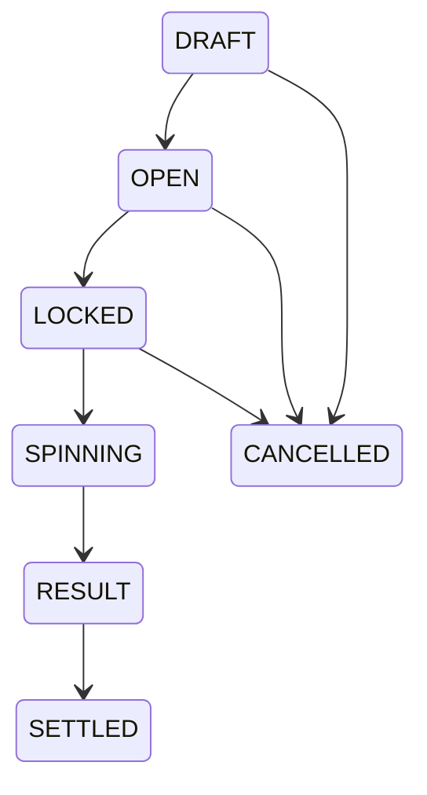

# Market Mayhem Architecture

## System boundary

React renders cached snapshots and submits commands. PostgreSQL is the source of truth. Netlify Functions authenticate requests, validate state, acquire locks and commit all state/financial mutations.

## Live update model

`game_nights.game_state_version` is monotonic. Admin, Player and Big Screen poll the lightweight version endpoint. A changed version triggers one targeted snapshot. The hook deduplicates snapshot work, aborts stale refreshes and version polls when appropriate, and throttles hidden tabs. Mobile cadence is selected from the backend `actionable` flag.

Server reads also synchronize timed state:

- expired `OPEN` predictions become `LOCKED`;
- a stored roulette `SPINNING` result becomes `RESULT` after the presentation interval.

Bet endpoints independently re-check market state/deadline inside their transaction, so a stale client cannot place a late wager.

## Settings

Production per-game settings on `game_nights` are:

- `name`
- `starting_balance`
- optional `maximum_wallet_percentage`

Legacy game-level prediction duration/min/max columns remain only for migration compatibility. Production prediction timing and stake validation use the fields stored on each `predictions` row.

New-player creation reads `starting_balance` inside the same transaction that creates the player, wallet and initial ledger entry. It also stores that value as the player's immutable `starting_balance_snapshot`, which is the baseline for first-join animation and exchange-value comparisons even when the configured starting balance is zero. Existing wallets and snapshots are never rewritten when Settings changes.

## Round execution and content

Round numbers are labels, not execution pointers. A partial unique database index allows at most one `ACTIVE` round per game. Normal lifecycle is `UPCOMING → ACTIVE → COMPLETED`.

`round_blocks` are ordered by `sort_order` and support:

- `TEXT`
- `QUESTION`
- `DUOLINGO_QUESTION`
- `ROULETTE`

`game_nights.current_round_block_id` is the operational content cursor. Previous/next controls are conveniences over block order; they never imply `round_number + 1`.

Starting a round opens all linked `SCHEDULED` predictions with each prediction's own duration. The start action does not select a round block or change `screen_state`: the projector remains on its current presentation until Admin explicitly shows a block, prediction, roulette scene, or the dashboard.

## Predictions

Admin authors `probability_yes` from 1–99%. The server derives and persists:

- `yes_odds = 1 / probability_yes`
- `no_odds = 1 / (1 - probability_yes)`

Each market owns `prediction_time_seconds`, `minimum_stake` and `maximum_stake`. Financially important fields are frozen once the market opens. Accepted bets preserve `odds_snapshot` and `potential_return`.

Public status maps `OPEN` directly and completed outcomes to `RESOLVED_YES`, `RESOLVED_NO` or `CANCELLED`. No crowd-voting stages exist.

### Prediction deposit transaction

Lock order is game → player → prediction → wallet. The server validates active player, market state, `closes_at`, per-market min/max, optional wallet percentage and one-bet rule. It then inserts the bet and `PREDICTION_DEPOSIT` ledger entry, debits available wallet and increments game version before commit.

The active bet is the locked-value record. While unresolved:

`total player value = wallet.current_balance + prediction locked + roulette locked`.

Settlement locks game → prediction → bets → relevant wallets. Winner credit is `round(stake × odds_snapshot)` (full return), loser credit is zero, and cancellation through `LOCKED` returns stake. After a YES/NO result is selected, settlement is mandatory rather than allowing a result-aware cancellation. Unique ledger keys plus endpoint idempotency prevent duplicate money movement.

## Round groups

`round_groups` and `round_group_members` are explicitly round-scoped. A player can belong to at most one group in a round. Structural group editing is blocked once the round is completed. Financial group adjustments become available once the round is ACTIVE and intentionally remain available retroactively after it is COMPLETED.

A group adjustment locks game → group → member players/wallets and creates one immutable `GROUP_ADJUSTMENT` ledger entry per member with the same amount/reason plus round/group attribution. There is no group wallet.

## Live Duolingo question

A `DUOLINGO_QUESTION` stores Admin-only configuration in the block payload: four answer texts, `correctAnswerIndex` and reward coins.

When the block is current, Player snapshots include only block identity, status, reward, the player's selected emoji index and post-reveal correctness. They never contain answer texts or correct index. Big Screen snapshots contain answer texts, but the correct index is stripped until `REVEALED`/`SETTLED`.

`round_question_answers` is unique by block/player. Reveal locks the question and winner wallets, appends idempotent `QUESTION_REWARD` entries and credits winners once. The reward is attributed to both round and block.

## Roulette

The canonical backend bet types are `NUMBER`, `COLOR`, `PARITY` and `RANGE`; visual table coordinates never define bets.

The SPIN command chooses `result_number` with server-side cryptographic randomness and stores it before animation starts. Big Screen may read that stored result to animate the wheel; Player and Admin state intentionally hide it while `SPINNING`. Cancellation is only permitted in `DRAFT`, `OPEN` or `LOCKED`, so a known/spinning outcome cannot be selectively cancelled.

Batch chip placement is canonical and transactional. Public Big Screen roulette data contains only display name, public color, normalized bet type/selection and stake.

## Projector state

`screen_state` explicitly selects:

- `DASHBOARD`
- `ROUND_BLOCK`
- `PREDICTIONS_OPEN`
- `PREDICTION_LOCKED`
- `PREDICTION_RESULT`
- `ROULETTE`

Opening a prediction does not touch `screen_state`; only explicit SHOW PREDICTION does. SHOW MAIN DASHBOARD is always available and changes presentation without changing underlying market state.

The exchange dashboard is derived from real financial chronology. Prediction/roulette deposits are represented as locked value until resolution, so graph value does not falsely fall merely because coins moved from available to locked.

## Security and reset

Admin sessions require `ADMIN_USERNAME`, `ADMIN_PASSWORD` and `SESSION_SECRET`. Player join tokens are single-use and raw values are never stored in the database. Raw session tokens live only in HttpOnly cookies; stored session digests are HMAC-protected.

Game reset requires Admin authentication, game ID and exact server-side phrase `yes delete`. It is transactional, game-scoped, writes `GAME_RESET`, deletes game-owned operational/financial data and recreates dashboard state while leaving Admin sessions/audit history available.
