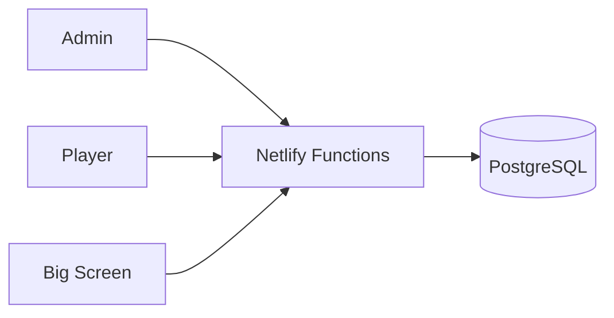
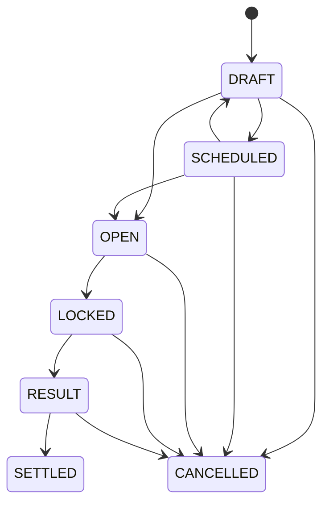

# Market Mayhem Architecture

## Boundaries

React is presentation/cache only. PostgreSQL is authoritative for game state and every financially meaningful operation. Netlify Functions authenticate, validate state transitions and perform transactional mutations.

## Live-state model

`game_nights.game_state_version` is monotonic. Admin, Player and Big Screen clients poll the lightweight version endpoint. A changed version triggers exactly one targeted snapshot. Hidden tabs use a slower cadence; requests are deduplicated and stale snapshot fetches are aborted. Mobile active cadence is driven by the server-provided `actionable` flag.

Expired `OPEN` predictions are synchronized to `LOCKED` by the server when live state/version is read. Bet placement independently verifies `closes_at`, so polling latency cannot permit a late wager.

## Settings

Per-game settings live on `game_nights`:

- `name`
- `starting_balance`
- `prediction_duration_seconds`
- `minimum_prediction_stake`
- `maximum_prediction_stake`
- optional `maximum_wallet_percentage`

Changing starting balance does not rewrite existing wallets. New-player creation reads the current value inside the same transaction that creates the player and wallet, plus a starting-balance ledger entry when the configured starting balance is non-zero.

## Rounds and content

Rounds are independent of their numeric label. One partial unique index enforces at most one `ACTIVE` round per game. State is `UPCOMING → ACTIVE → COMPLETED`.

Each round owns ordered `round_blocks` of type `TEXT`, `QUESTION` or `ROULETTE`. `game_nights.current_round_block_id` is the operational cursor. Admin may jump to any block in the active round; previous/next are UI conveniences over `sort_order`, not round-number progression.

Starting a round also opens every prediction in `SCHEDULED` state linked to that round and assigns timestamps from Settings.

## Prediction state machine

YES/NO odds are Admin-authored and immutable once a prediction opens. One player may place one bet per prediction. `bets.odds_snapshot` is the payout authority.

Bet transaction: lock game → player → wallet → prediction, verify status/deadline/settings/duplicate, insert bet, append `BET_STAKE`, debit wallet, increment version, commit. Ledger and wallet writes are in the same PostgreSQL transaction.

Settlement locks the game/prediction/bets and winner wallets. Winners receive `round(stake × odds_snapshot)` as total return; losers receive zero. Cancellation refunds the stake. Unique ledger constraints and idempotency keys prevent duplicate money movement.

## Roulette

A roulette block owns one or more historical `roulette_games`. The active spin uses:

`DRAFT → OPEN → LOCKED → RESULT → SETTLED`

It may be cancelled before settlement. Mobile selections are normalized server-side. Straight-number return is 36× total return; red/black, odd/even and low/high are 2×. Zero loses all even-money bets.

Roulette stakes, payouts and refunds are immutable ledger entries and transactional wallet updates. While a roulette market is financially live (`OPEN`, `LOCKED` or `RESULT`), the projector cannot be switched away from that roulette composition until the market is settled or cancelled.

## Wallet/ledger invariants

- Wallet balance never goes negative.
- Old ledger rows are never edited.
- Wallet-affecting actions create a ledger row in the same transaction.
- Prediction/roulette stake is removed immediately and remains represented as locked stake while unresolved.
- Total coins in play = active wallets + unresolved prediction stakes + unresolved roulette stakes.
- High-impact manual changes, prediction placement/settlement and roulette placement/settlement use idempotency keys.

## Big Screen

`screen_state` explicitly selects one composition:

- `DASHBOARD`
- `ROUND_BLOCK`
- `PREDICTIONS_OPEN`
- `PREDICTION_LOCKED`
- `PREDICTION_RESULT`
- `ROULETTE`

The dashboard snapshot is public-safe and derives graph/ticker values from real ledger history. No private Admin notes or per-player private bet selections are exposed.

## Delete/reset

`reset-game` requires Admin auth, game ID and exact server-side phrase `yes delete`. It locks the requested game, writes `GAME_RESET`, clears game-owned operational/financial content transactionally, restores default settings and recreates Dashboard screen state. It does not delete another game or revoke the current Admin session.

## Authentication

Admin credentials are environment-configured using `ADMIN_USERNAME` and `ADMIN_PASSWORD`. `SESSION_SECRET` is required and used to HMAC the digest stored for opaque session tokens. Player join tokens are random, single-use and hashed separately. Player identity is resolved only from HttpOnly session cookies.
