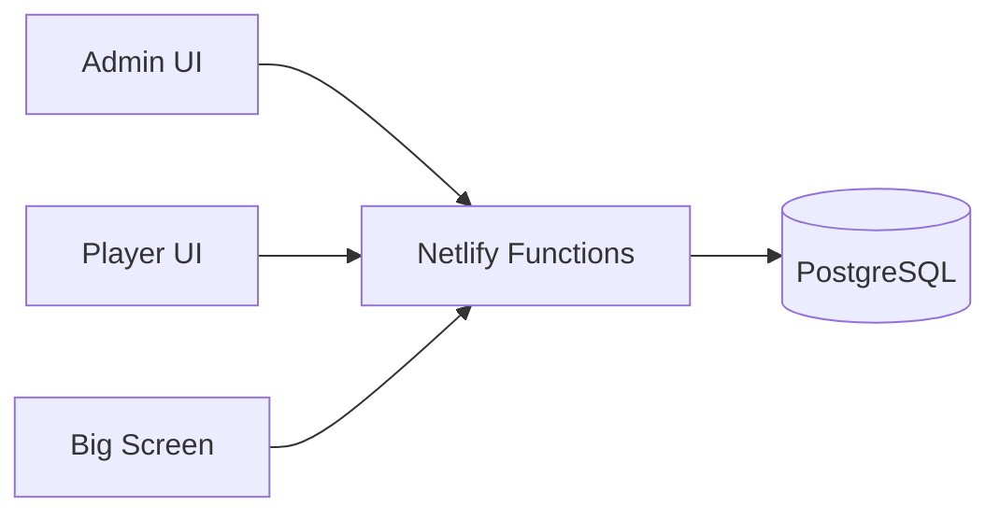
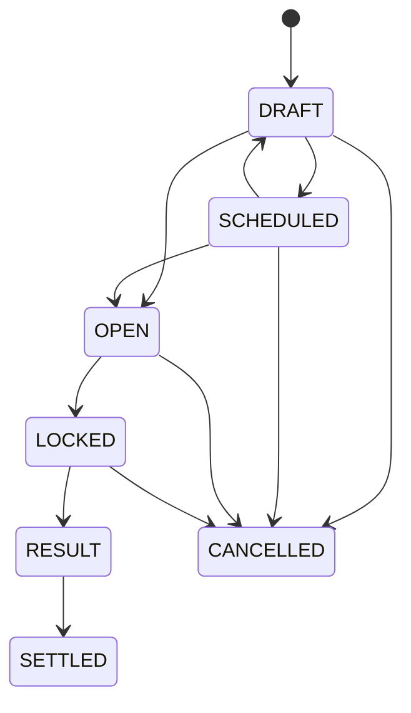
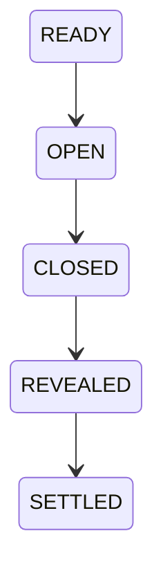
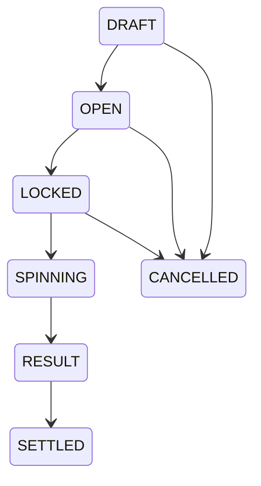
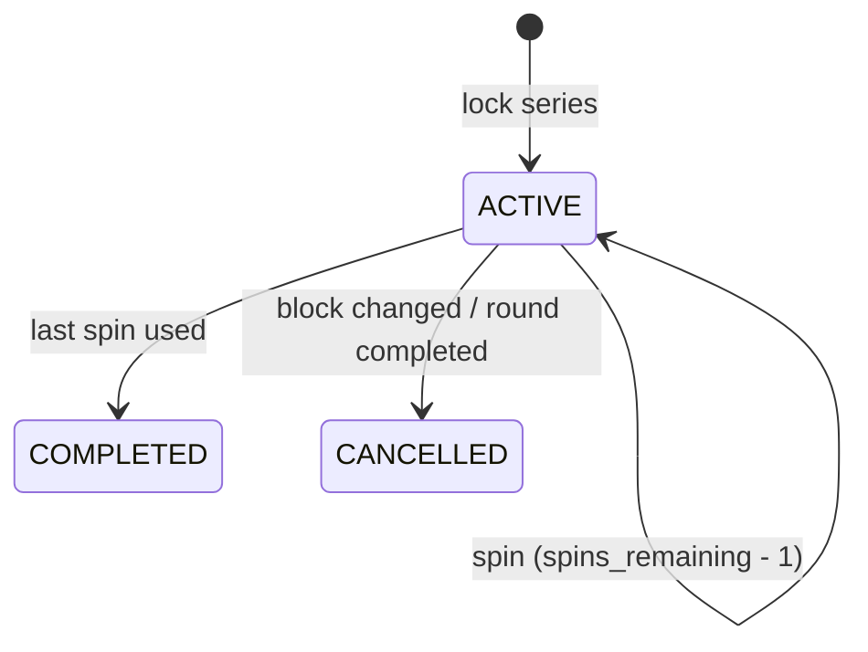
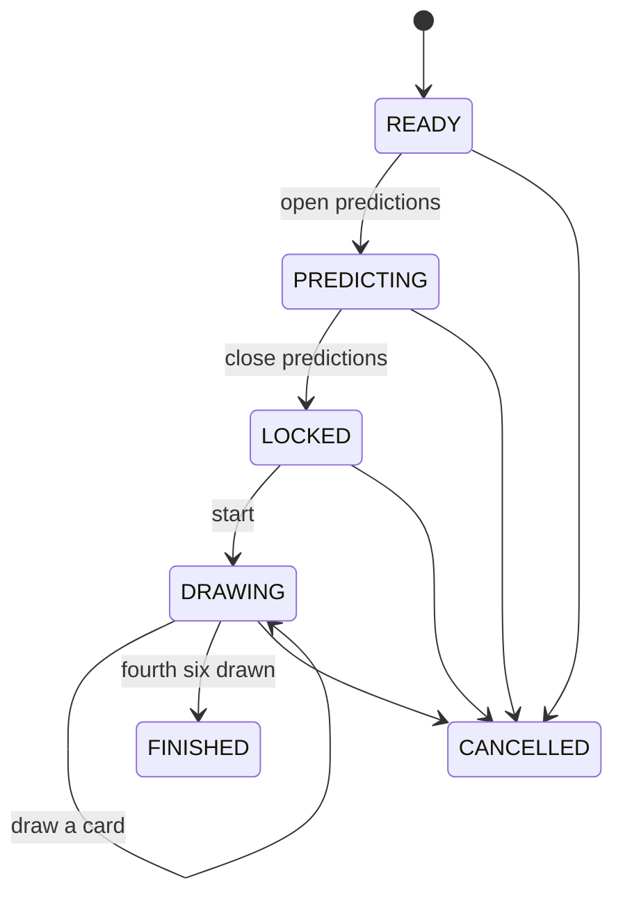
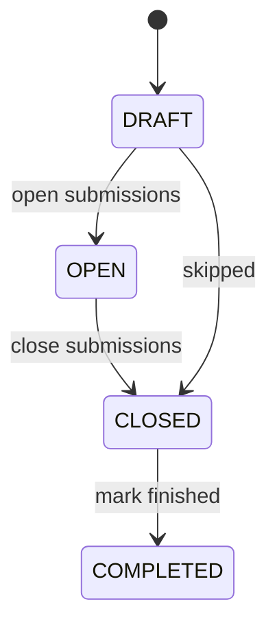

# Market Mayhem Architecture

## System boundary

React renders cached snapshots and submits commands. PostgreSQL is the source of truth. Netlify Functions authenticate requests, validate state, acquire locks and commit all state/financial mutations.

## Live update model

`game_nights.game_state_version` is monotonic. Admin, Player and Big Screen poll the lightweight version endpoint. A changed version triggers one targeted snapshot. The hook deduplicates snapshot work, aborts stale refreshes and version polls when appropriate, and throttles hidden tabs. Mobile cadence is selected from the backend `actionable` flag.

Server reads also synchronize timed state:

- expired `OPEN` predictions become `LOCKED`;
- a stored roulette `SPINNING` result becomes `RESULT` after the presentation interval;
- a slot spin becomes `RESULT` after `SLOT_SPIN_MS`, ending the reel-animation window.

A live Pak een Zes also keeps clients on the fast poll tier, so every surface updates within one interval of each card.

Bet endpoints independently re-check market state/deadline inside their transaction, so a stale client cannot place a late wager.

## Settings

Production per-game settings on `game_nights` are:

- `name`
- `starting_balance`
- optional `maximum_wallet_percentage`

Legacy game-level prediction duration/min/max columns remain only for migration compatibility. Production prediction timing and stake validation use the fields stored on each `predictions` row.

New-player creation reads `starting_balance` inside the same transaction that creates the player, wallet and initial ledger entry. It also stores that value as the player's immutable `starting_balance_snapshot`, which is the baseline for first-join animation and exchange-value comparisons even when the configured starting balance is zero. Existing wallets and snapshots are never rewritten when Settings changes.

## Round execution and content

Round numbers are labels, not execution pointers. A partial unique database index allows at most one `ACTIVE` round per game. Normal lifecycle is `UPCOMING → ACTIVE → COMPLETED`.

`round_blocks` are ordered by `sort_order` and support:

- `TEXT`
- `QUESTION`
- `DUOLINGO_QUESTION`
- `ROULETTE`
- `PICTURE`, `MUSIC`, `BUZZER`, `WAGER`
- `SLOTMACHINE`
- `PAK_EEN_ZES`
- `FOTORONDE`

`game_nights.current_round_block_id` is the operational content cursor. Previous/next controls are conveniences over block order; they never imply `round_number + 1`.

Starting a round opens all linked `SCHEDULED` predictions with each prediction's own duration. The start action does not select a round block or change `screen_state`: the projector remains on its current presentation until Admin explicitly shows a block, prediction, roulette scene, or the dashboard.

## Predictions

Admin authors `probability_yes` from 1–99%. The server derives and persists:

- `yes_odds = 1 / probability_yes`
- `no_odds = 1 / (1 - probability_yes)`

Each market owns `prediction_time_seconds`, `minimum_stake` and `maximum_stake`. Financially important fields are frozen once the market opens. Accepted bets preserve `odds_snapshot` and `potential_return`.

Public status maps `OPEN` directly and completed outcomes to `RESOLVED_YES`, `RESOLVED_NO` or `CANCELLED`. No crowd-voting stages exist.

### Prediction deposit transaction

Lock order is game → player → prediction → wallet. The server validates active player, market state, `closes_at`, per-market min/max, optional wallet percentage and one-bet rule. It then inserts the bet and `PREDICTION_DEPOSIT` ledger entry, debits available wallet and increments game version before commit.

The active bet is the locked-value record. While unresolved:

`total player value = wallet.current_balance + prediction locked + roulette locked`.

Settlement locks game → prediction → bets → relevant wallets. Winner credit is `round(stake × odds_snapshot)` (full return), loser credit is zero, and cancellation through `LOCKED` returns stake. After a YES/NO result is selected, settlement is mandatory rather than allowing a result-aware cancellation. Unique ledger keys plus endpoint idempotency prevent duplicate money movement.

## Round groups

`round_groups` and `round_group_members` are explicitly round-scoped. A player can belong to at most one group in a round. Structural group editing is blocked once the round is completed. Financial group adjustments become available once the round is ACTIVE and intentionally remain available retroactively after it is COMPLETED.

A group adjustment locks game → group → member players/wallets and creates one immutable `GROUP_ADJUSTMENT` ledger entry per member with the same amount/reason plus round/group attribution. There is no group wallet.

## Live Duolingo question

A `DUOLINGO_QUESTION` stores Admin-only configuration in the block payload: four answer texts, `correctAnswerIndex` and reward coins.

When the block is current, Player snapshots include only block identity, status, reward, the player's selected emoji index and post-reveal correctness. They never contain answer texts or correct index. Big Screen snapshots contain answer texts, but the correct index is stripped until `REVEALED`/`SETTLED`.

`round_question_answers` is unique by block/player. Reveal locks the question and winner wallets, appends idempotent `QUESTION_REWARD` entries and credits winners once. The reward is attributed to both round and block.

## Roulette

The canonical backend bet types are `NUMBER`, `COLOR`, `PARITY` and `RANGE`; visual table coordinates never define bets.

The SPIN command chooses `result_number` with server-side cryptographic randomness and stores it before animation starts. Big Screen may read that stored result to animate the wheel; Player and Admin state intentionally hide it while `SPINNING`. Cancellation is only permitted in `DRAFT`, `OPEN` or `LOCKED`, so a known/spinning outcome cannot be selectively cancelled.

Batch chip placement is canonical and transactional. Public Big Screen roulette data contains only display name, public color, normalized bet type/selection and stake.

## Slotmachine

A `SLOTMACHINE` block is a round content type whose configuration is split by scope:

- **game-wide, in Settings** — the symbol artwork (12 PNGs, shared by all three reels) and the chance/payout for each of the five outcome types. There is one machine for the night, so these are configured once and reused by every slot block.
- **per block, in `round_blocks.payload`** — title, instruction text, `maxSpins` per series and an optional `allowedPlayerIds` allowlist (empty means everyone).

Symbols are shared rather than per reel: migration `0010` gave each reel its own twelve uploads, which meant asking for 36 files for a machine whose reels look alike, so `0011` collapsed `slot_reel_symbols` to one row per position.

Migration `0012` then removed the per-combination model entirely. `0010`/`0011` stored a chance and a payout for each specific symbol triple — up to 1728 rows, with `AAA` meaning three copies of one particular image. That is replaced by the five outcome types below, and the configuration no longer mentions images at all.

Symbol artwork reuses the round-media path: `upload-block-media` with `kind=image` stores the file in Netlify Blobs and only the key is persisted, and `block-media` serves it. No second upload or storage mechanism was added.

### Outcome selection

The machine pays for **patterns, not pictures**. There are five fixed outcome types, each with an Admin-set chance and payout in `slot_outcome_types`:

`NO_WIN`, `TWO_SPLIT` (`C D C` on the main row), `TWO_ADJACENT` (`C C D` / `D C C`), `THREE_LINE` (three alike on a payline), `THREE_ANYWHERE` (three alike off the paylines).

The visible field is 3 rows × 3 reels. Paylines are the three rows and the two diagonals; columns are deliberately excluded, since a column is one reel. Row 1 is the main row and is what decides the two-alike categories. `TWO_ADJACENT` and `TWO_SPLIT` are separate categories precisely so side-by-side can out-pay split.

A spin runs in two steps, both server-side:

1. `pickOutcomeType` draws a category weighted-random from the configured chances.
2. `generateGrid` builds a 3×3 field for that category, choosing the symbol and the positions at random from the twelve uploaded symbols.

`generateGrid` constructs rather than rejection-samples blindly: it places the pattern, then fills the remaining cells under two constraints — a per-symbol cap of two occurrences (so a pair cannot become a loose triple) and a rule against completing a payline through the cell being filled. It then calls `classifyGrid` on its own result and retries if it does not match, and `slot-spin` re-derives the verdict a second time before paying. That double check is what makes the configured chances the chances players actually see: a spin drawn as `TWO_ADJACENT` can never also show three alike.

`classifyGrid` is the arbiter and is a total function — every field maps to exactly one category, by precedence: three on a line, then a loose triple, then an adjacent pair on the main row, then a split pair, then no win. Precedence matters because a field can satisfy more than one description and only one of them can be paid.

The payout comes from the drawn category, never from which symbols filled it. `winningCells` returns the cells the Big Screen highlights.

Configuration validity has one definition, in `netlify/lib/slotmachine.ts`, reached by two routes that must not disagree: `evaluateSlotConfig` from the full configuration (Admin surfaces and every write path), and `describeSlotConfig` from SQL aggregates on the player snapshot's hottest query. A machine is valid when the total is above zero, the five chances sum to it exactly, and all twelve symbols have artwork — the last because the generator draws freely from the whole set. An invalid machine is still *saveable*, so the Admin can nudge numbers into place, but locking a series and spinning both refuse it.

### Turns

One player at a time, and that player uses their entire bought run before the next starts. The turn is **derived, not stored**: `resolveSlotTurn` takes the block's series in lock order and the turn is simply the head of "who still has spins". A stored turn pointer can drift out of step with the spins that actually happened and there is no reconciliation step that would fix it; here the spins *are* the turn state.

Two gates are enforced in `slot-spin`, never trusted from the phone:

- only `turn.current` may spin, so a request from anyone else is a 403;
- no spin may begin while one is still `SPINNING`, so tapping SPIN repeatedly cannot buy several spins — a spin only counts once it has a final outcome.

`spinningPlayerId` keeps the current player in place while their spin resolves, even once it took their last spin. Without that the projector would cut to the next player while the previous one's final result was still on screen; with it, the handover happens after the reveal.

`maySpin` is the single verdict both sides use — the player snapshot sends it so the phone enables exactly what the server would allow, which is why the button and the enforcement cannot disagree.

A run is bought once. `slot-lock-series` refuses a second series for the same player on the same block, whether the first is still running or already used, so there is no topping up; a `CANCELLED` series does not count, since that only happens when the host leaves the block and the machine starts over. `SLOT_MAX_SPINS_LIMIT` is 10, clamped on read as well as on write so a block authored before that rule cannot still sell a longer run.

### Series and spins

Locking debits the **whole** total stake in one `SLOT_STAKE` entry, mirroring a prediction deposit rather than a roulette chip: the coins are committed to the machine and cannot be spent elsewhere between spins. The unspun remainder is logical locked value (`stake_per_spin x spins_remaining`) and counts toward total player value alongside prediction and roulette locks.

Each spin is one transaction that chooses the outcome, writes `slot_spins`, credits any payout as `SLOT_PAYOUT` and decrements `spins_remaining`. The payout is credited with the decision rather than after the animation, so there is no unsettled money and no Admin settle step to forget — which is also why the host has no SPIN control: players start their own spins.

Idempotency and concurrency are handled on three levels, so a double SPIN tap cannot produce two spins: `FOR UPDATE` on the series serialises concurrent requests, `UNIQUE (slot_series_id, idempotency_key)` answers a replay with the spin it already produced, and the decrement carries `WHERE spins_remaining > 0` behind a `>= 0` check constraint.

`status='SPINNING'` is purely presentational. The outcome is final when the row is written; the same timed sync that reveals a roulette result flips the spin to `RESULT` after `SLOT_SPIN_MS`, which is what lets the phone and the Admin hold the outcome back until the projector's reels have landed.

### Leaving a slotmachine block

Changing content block or completing the round **closes every live series and refunds unused spins** (`closeSlotSeriesForBlock`), rather than blocking the move as an unfinished roulette does. That is a deliberate difference: a slot series is player-driven and there may be one per player, so blocking would let a player who locked twenty spins and wandered off hold the evening hostage. No coins are lost — only the unspun remainder is returned, and spins already taken keep their outcome and payout. The refund is idempotent through a partial unique index on `(slot_series_id, 'SLOT_REFUND')`.

Because a deactivated player can no longer spin, `remove-player` refuses while they hold a live series and points the Admin at moving on to refund it.

## Pak een Zes

A `PAK_EEN_ZES` block: predictions, then turn-based card draws, then a payout for the predictions that came true.

The machine runs forwards only. Closing before starting is what makes "who has not predicted yet" a meaningful question — once cards are out, a late prediction would be about something already happening. The host is explicitly not required to wait for everyone, which is why the Admin panel names the missing players rather than only counting them.

### Predictions

Four ordered picks per player, one row per slot in `pak_een_zes_predictions`. Duplicates and self-picks are allowed and must survive: the per-slot shape is what keeps `Daan, Twan, Daan, Bas` as four picks instead of collapsing to three names. `validatePrediction` therefore never de-duplicates. A prediction only counts as submitted once all four slots are in, which is what makes the "still to predict" list trustworthy.

### Turn order

Frozen at START from the players active at that moment and stored in `pak_een_zes_participants`, ordered by display name. Storing it rather than deriving it is deliberate: a player joining or being deactivated mid-game must not reshuffle whose turn it is. `turn_index` walks the order and wraps, because the game ends when the sixes run out rather than after one lap.

### Drawing

The server owns both halves — which card, and whose turn. `playerAtTurn` is the same function the player snapshot uses to decide whether to enable the button, so the button and the server's enforcement cannot disagree; a request from anyone else gets a 403.

The remaining deck is derived from the rows already drawn rather than from a shuffled list held anywhere, so there is no in-memory state to fall out of step and a replay cannot resurrect a card. `UNIQUE (pak_een_zes_game_id, rank, suit)` makes "no repeats" a database guarantee rather than an application promise.

Double-tap protection has three layers: `FOR UPDATE` on the game row serialises concurrent requests, `UNIQUE (game, idempotency_key)` answers a replay with the card it already produced, and the turn advances exactly once inside the same transaction. The game flips to `FINISHED` in that same transaction the moment the fourth six is out.

### Scoring

One Admin-set amount per correct prediction, on `game_nights.pak_een_zes_points_per_correct` — a single game-wide value rather than a rate per player, six or slot.

`countCorrectPredictions` is a **multiset intersection**: each pick is matched against one six that player drew, and a six can satisfy only one pick. That is what makes the brief's example score three — Bas named twice and drawing two sixes counts twice, while Bas named twice and drawing one six counts once.

`awardPakEenZesPredictions` runs inside the transaction that draws the fourth six, so the reward lands with the event that earned it: no separate Admin action to forget, and no window where the game is over but unscored. It follows the live question's `QUESTION_REWARD` path exactly — one `PAK_EEN_ZES_REWARD` ledger row plus a wallet credit, guarded by a partial unique index on `(pak_een_zes_game_id, player_id)`. A conflict is verified against the row that already exists rather than swallowed.

The rate is snapshotted onto `pak_een_zes_games.points_per_correct` when the game pays, and the award function reads that snapshot in preference to the live setting. Both matter: the snapshot stops a later Settings change from rewriting what a finished game awarded, and reading it on a retry is what keeps the retry a clean no-op instead of a spurious conflict.

An incomplete prediction — fewer than four slots — never scores. Only `FINISHED` games pay; a game cancelled when the host leaves the block does not.

Per-player results are recomputed on read from the picks and the six events rather than stored, so the breakdown every surface shows always matches the rows behind it.

### Leaving the block

Changing content block or completing the round **cancels** a live game (`closePakEenZesForBlock`) rather than blocking the move. Nothing financial is at stake, but leaving it in `DRAWING` would keep a turn indicator live on somebody's phone for a game nobody is watching. Draws and predictions are kept — cancelling must never erase the record. A finished game is left alone, and re-activating the block that is already live is a no-op so a dashboard detour and back cannot kill a game mid-play.

## Fotoronde

A `FOTORONDE` block: each team submits one photo per subject, and the Admin awards credits per photo which are split across that team's members.

**Teams are round groups**, created by the Admin. `round_group_members` is unique by `(round_id, player_id)`, so a player's team is derivable from their session — which is what makes "uploading on behalf of your own team" enforceable rather than a matter of trust. `playerTeamForRound` is the only source of that answer; the phone never sends a team. The legacy `teams` table is untouched and unread.

The Fotoronde panel creates and populates teams in place, through the existing `upsert-round-group` / `set-round-group-members` / `delete-round-group` endpoints and the groups already in the Admin snapshot. No second team model, and no new endpoint — the host simply reaches them where they need them, since the block cannot open without at least one. Because photo rewards carry `round_group_id`, the existing delete guard already refuses to remove a team that earned credits.

**Subjects** live in the block payload as `{key, label}` pairs, defaulting to the standard six. The key is the identity and a submission is filed under it, so renaming a subject keeps its photos while the label is free to change. `normalizeSubjects` derives and de-duplicates keys, so two subjects that read alike can never inherit each other's photos.

Forward-only. Uploads are accepted in `OPEN` alone; awards in `CLOSED` and `COMPLETED`. There is no route back to `OPEN` because a team must not be able to swap a photo the Admin has already judged, and `COMPLETED` still accepts awards so marking it done is not a trap.

### Uploads

`upload-photo-submission` is player-authenticated but reuses the round-media blob store and `lib/media`'s size and type limits — a photo round is round media like any other, and its bytes must not reach the database. Validation happens before a byte is stored, so a refused submission leaves no orphaned file, and the phase is re-checked inside the writing transaction so a photo cannot land after the Admin closed submissions.

One photo per team per subject is a database guarantee: `UNIQUE (photo_round_id, subject_key, group_id)` plus an upsert, so a second upload from any team-mate replaces the team's photo rather than adding one.

### Credits

`distributeCredits` splits an award across the team's **active** members: `floor(credits / members)` each, with the remainder handed out one credit at a time down a stable member order (display name, then id). The amounts therefore always sum to exactly what was awarded — nothing lost to rounding, nothing invented by it — and the same input always produces the same split, including on a retry. The Admin panel states the split before the award is confirmed.

`payPhotoSubmission` writes one `PHOTO_ROUND_REWARD` ledger row plus a wallet credit per member, exactly as a group adjustment does. Double payment is impossible rather than guarded against: `credits_awarded IS NULL` gates it under a row lock, and behind that a partial unique index on `(photo_submission_id, player_id)` refuses a second credit. A repeat request is answered with what was already awarded rather than an error.

The split shown for a **judged** photo is read back from the ledger rows rather than recomputed, because a team's membership can change after an award — the figure has to be the split that happened, not what today's team would receive.

### Edge cases

- **Deactivating a player** removes them from future splits (active members only) but never claws back what they were paid.
- **Changing team membership** never touches existing submissions; `uploaded_by` is `ON DELETE SET NULL` so removing a player keeps their team's photo and its credits.
- **Leaving the block or completing the round** moves an open Fotoronde to `CLOSED`, not cancelled: the photos and the chance to award credits for them are the point of the block, so ending the upload window never discards unjudged work. Round completion therefore leaves scoring clearly unstarted rather than half-finished, and the Admin panel reports how many photos are still unjudged.
- **Deleting the block or round** is refused once photos exist, since those photos may already have paid credits.

## Projector state

`screen_state` explicitly selects:

- `DASHBOARD`
- `ROUND_BLOCK`
- `PREDICTIONS_OPEN`
- `PREDICTION_LOCKED`
- `PREDICTION_RESULT`
- `ROULETTE`
- `SLOTMACHINE`
- `PAK_EEN_ZES`
- `FOTORONDE`

Each block type has exactly one composition that can present it: `setScreenMode` refuses `ROUND_BLOCK` for a roulette or slotmachine block and refuses `SLOTMACHINE` for anything else, so the projector cannot be pointed at a slot block with the plain content scene.

Opening a prediction does not touch `screen_state`; only explicit SHOW PREDICTION does. SHOW MAIN DASHBOARD is always available and changes presentation without changing underlying market state.

### Presenter model — staged, live, previous

`screen_state` carries three parallel pointers, all on the one row (migration `0008`):

- the live set (`mode`, `round_id`, `prediction_id`, `payload`) — what the projector is showing;
- `staged_*` — what `GO LIVE` will promote next. Staging is deliberately near side-effect-free: it moves nothing on screen;
- `previous_*` — filled only when the host jumps to the dashboard with `remember`, so BACK TO RUN OF SHOW returns to the exact step rather than guessing.

`promoteStaged` routes blocks through `setActiveRoundBlock`, so every existing guard still applies — an unfinished live question or a roulette in progress refuses the promotion rather than being bypassed. After promoting it advances the staged pointer to the next run-of-show step.

Run-of-show order has exactly one implementation, `netlify/lib/run-of-show.ts`, used by both the Admin strip and `promoteStaged`. That is the point: `GO LIVE` cannot skip or repeat a step relative to what the host is looking at.

Both `staged_*` and `previous_*` live in the row `getAdminState` already reads, so the presenter model costs no extra query.

### Previewing a player's phone

`player-state-preview` returns the exact `player-state` payload for a chosen player, read with Admin authority, and the Admin modal renders the same `MobileViews` components the live player app uses. It is read-only — every submit control is disabled and no mutation can fire.

It is an Admin-authenticated read rather than an impersonated session: minting a real player session for the Admin would be new auth surface, and a same-origin preview would overwrite the `mm_player_session` cookie of anyone also joined as a player in another tab.

The exchange dashboard is derived from real financial chronology. Prediction/roulette deposits are represented as locked value until resolution, so graph value does not falsely fall merely because coins moved from available to locked.

## Security and reset

Admin sessions require `ADMIN_USERNAME`, `ADMIN_PASSWORD_HASH` and `SESSION_SECRET`. `ADMIN_PASSWORD_HASH` is a salted PBKDF2-HMAC-SHA256 value generated by `npm run admin:hash`; the plaintext Admin password is not stored in configuration. Player join tokens are single-use and raw values are never stored in the database. Raw session tokens live only in HttpOnly cookies; stored session digests are HMAC-protected.

Game reset requires Admin authentication, game ID and exact server-side phrase `yes delete`. It is transactional, game-scoped, writes `GAME_RESET`, deletes game-owned operational/financial data — including slotmachine symbols, outcomes, series and spins, and Pak een Zes games, predictions, participants and draws — and recreates dashboard state while leaving Admin sessions/audit history available.
