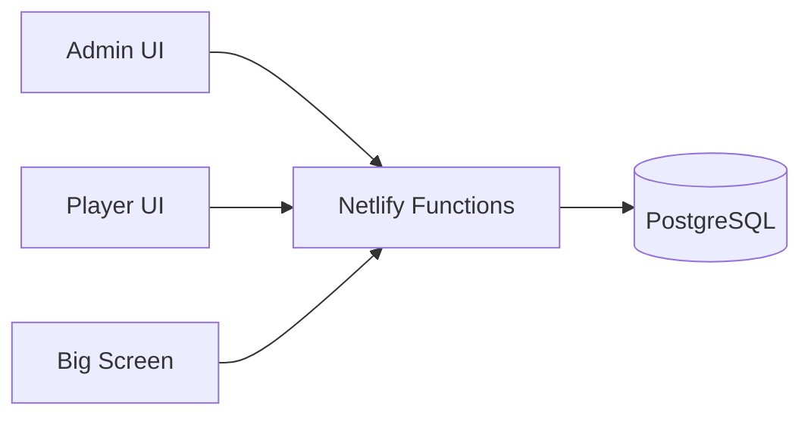
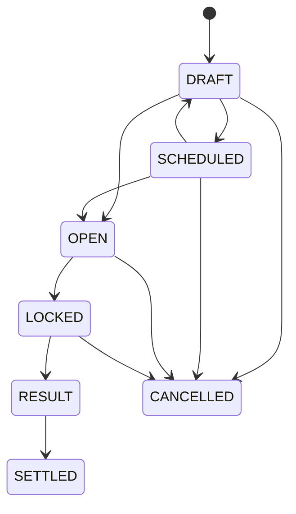
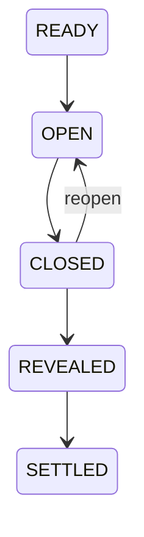
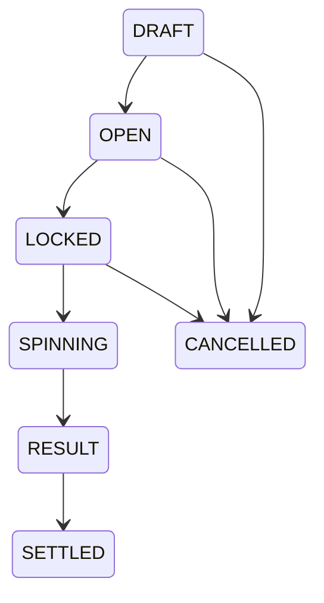
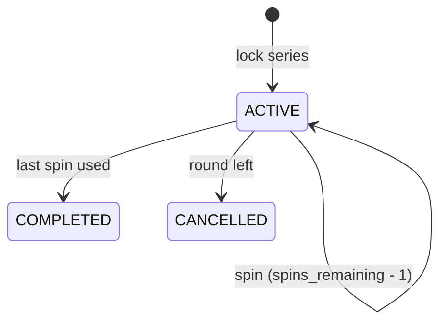
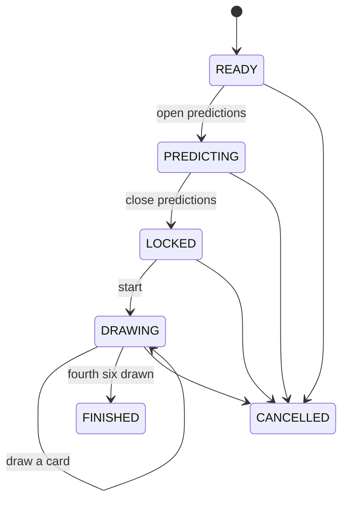
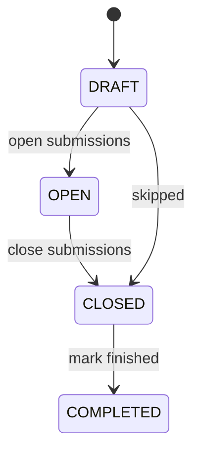

# Market Mayhem Architecture

## System boundary

React renders cached snapshots and submits commands. PostgreSQL is the source of truth. Netlify Functions authenticate requests, validate state, acquire locks and commit all state/financial mutations.



## Live update model

`game_nights.game_state_version` is monotonic. Admin, Player and Big Screen poll the lightweight version endpoint. A changed version triggers one targeted snapshot. The hook deduplicates snapshot work, aborts stale refreshes and version polls when appropriate, and throttles hidden tabs. Mobile cadence is selected from the backend `actionable` flag.

Server reads also synchronize timed state:

- expired `OPEN` predictions become `LOCKED`;
- a stored roulette `SPINNING` result becomes `RESULT` after the presentation interval;
- a slot spin becomes `RESULT` after `SLOT_SPIN_MS`, ending the reel-animation window.

A live Pak een Zes also keeps clients on the fast poll tier, so every surface updates within one interval of each card.

Bet endpoints independently re-check market state/deadline inside their transaction, so a stale client cannot place a late wager.

## Settings

Production per-game settings on `game_nights` are:

- `name`
- `starting_balance`
- optional `maximum_wallet_percentage`

Legacy game-level prediction duration/min/max columns remain only for migration compatibility. Production prediction timing and stake validation use the fields stored on each `predictions` row.

New-player creation reads `starting_balance` inside the same transaction that creates the player, wallet and initial ledger entry. It also stores that value as the player's immutable `starting_balance_snapshot`, which is the baseline for first-join animation and exchange-value comparisons even when the configured starting balance is zero. Existing wallets and snapshots are never rewritten when Settings changes.

## Rounds

A round is the primary content object. It has exactly one `type`, chosen when it is
created and never changed afterwards — content authored under one type has nowhere to go
under another, so `edit-round` has no type parameter and changing type means creating the
other round.

The six types:

| Type | Content | Phones | Reward |
|---|---|---|---|
| `LIVE_QUIZ` | ordered `live_quiz_questions`, each with its own options | answer buttons | points per question |
| `PRESENTATIE` | ordered `presentation_slides` | — | none |
| `ROULETTE` | none beyond title and instructions | place chips | the bet type's own multiplier |
| `SLOTMACHINE` | `slotmachine_rounds` + participants allowlist | lock a run, spin | the outcome's own multiplier |
| `PAK_EEN_ZES` | none; the deck and rules are fixed | predict, draw | `rounds.default_points` per correct prediction |
| `FOTORONDE` | ordered `fotoronde_subjects`, each with its own credits | upload one photo per subject | credits per photo, split across the team |

`rounds.sort_order` is a label and an ordering, never an execution pointer. Lifecycle is
`UPCOMING → ACTIVE → COMPLETED`, and a partial unique index allows at most one `ACTIVE`
round per game.

`rounds.default_points` is what new content inherits — a new quiz question or Fotoronde
subject starts at it and then overrides it freely. For Pak een Zes it is the rate itself,
snapshotted onto the game when it finishes so a later change never rewrites history.

### Authored content and runtime state are separate tables

`live_quiz_questions` holds what the Admin wrote; `live_quiz_question_state` holds what
phase it is in. Same for `presentation_slides` / `presentation_slide_state`. Editing a
question and running one are therefore two writes to two different tables, and a full
reset can set the runtime back without touching a word of the content.

### The execution cursor

`round_runtime` is one row per round: `current_quiz_question_id`, `current_slide_id`, and
a `revision`. It replaced `game_nights.current_round_block_id`, and the difference is the
point — progression belongs to the round being played rather than to the game, so a
completed round keeps the cursor it ended on.

`revision` is the optimistic-locking token. Every navigation command sends the revision it
read, and the write is `WHERE revision = $expected`. A stale NEXT QUESTION from a second
admin tab therefore matches no row and is answered with a 409, rather than quietly pulling
the room back a question.

### Starting a round

`start-round` sets the round `ACTIVE`, prepares its runtime through `enterRound`, and opens
any `SCHEDULED` predictions attached to it. It does **not** touch `screen_state`: the
projector stays exactly where it was until the Admin explicitly shows something.
`enterRound` writes no presentation state at all, which is what makes that structural
rather than a convention.

### Navigation is per type

There is no generic previous/next. A quiz moves between questions (`quiz-navigate`), a
presentation between slides (`slide-navigate`), and the three game rounds do not move at
all — they open, run and settle through their own endpoints. The previous model shared one
stepper across all of them, which meant pretending a roulette and a quiz question had the
same shape.

Advancing a cursor follows the projector **only if the projector was already showing that
round's content**. A host who stepped away to the market dashboard keeps their dashboard;
progression never seizes the screen.

### Leaving a round

Every path that ends a round goes through `assertRoundMayBeLeft` then `leaveRound` in
`netlify/lib/round-lifecycle.ts`. The policy is per type and deliberately not uniform:

- **`LIVE_QUIZ`** refuses while a question is `OPEN`, `CLOSED` or `REVEALED` but unsettled.
  Answers were given and a reward was not paid; walking away loses somebody's points.
- **`ROULETTE`** refuses while a game holds money. A `DRAFT` game, which holds none, is
  cancelled instead.
- **`SLOTMACHINE`** refunds and closes rather than blocking. A series is per player, and
  one player who locked twenty spins and wandered off must not be able to hold the evening
  hostage. No coins are lost: the unspun remainder returns and spins already taken keep
  their payout.
- **`PAK_EEN_ZES`** cancels. Nothing financial is at stake, but leaving it in `DRAWING`
  keeps a turn indicator live on somebody's phone for a game nobody is watching. Draws and
  predictions are kept — cancelling must never erase the record.
- **`FOTORONDE`** closes and keeps everything. Its photos and the chance to award credits
  for them are the point of the round.
- **`PRESENTATIE`** has nothing to settle.

The previous version of this rule was copied into `setActiveRoundBlock` and
`complete-round` with subtly different guards and a different order. Centralising it is not
tidiness: a policy in two places is a policy one route can skip.

## Predictions

Admin authors `probability_yes` from 1–99%. The server derives and persists:

- `yes_odds = 1 / probability_yes`
- `no_odds = 1 / (1 - probability_yes)`

Each market owns `prediction_time_seconds`, `minimum_stake` and `maximum_stake`. Financially important fields are frozen once the market opens. Accepted bets preserve `odds_snapshot` and `potential_return`.



Public status maps `OPEN` directly and completed outcomes to `RESOLVED_YES`, `RESOLVED_NO` or `CANCELLED`. No crowd-voting stages exist.

### Prediction deposit transaction

Lock order is game → player → prediction → wallet. The server validates active player, market state, `closes_at`, per-market min/max, optional wallet percentage and one-bet rule. It then inserts the bet and `PREDICTION_DEPOSIT` ledger entry, debits available wallet and increments game version before commit.

The active bet is the locked-value record. While unresolved:

`total player value = wallet.current_balance + prediction locked + roulette locked`.

Settlement locks game → prediction → bets → relevant wallets. Winner credit is `round(stake × odds_snapshot)` (full return), loser credit is zero, and cancellation through `LOCKED` returns stake. After a YES/NO result is selected, settlement is mandatory rather than allowing a result-aware cancellation. Unique ledger keys plus endpoint idempotency prevent duplicate money movement.

## Round groups

`round_groups` and `round_group_members` are explicitly round-scoped. A player can belong to at most one group in a round. Structural group editing is blocked once the round is completed. Financial group adjustments become available once the round is ACTIVE and intentionally remain available retroactively after it is COMPLETED.

A group adjustment locks game → group → member players/wallets and creates one immutable `GROUP_ADJUSTMENT` ledger entry per member with the same amount/reason plus round/group attribution. There is no group wallet.

## Live quiz questions

A `LIVE_QUIZ` round holds ordered `live_quiz_questions`. Each carries its own prompt,
supporting text, **points**, optional timer, optional context photo, and its own
`live_quiz_question_options` — rows rather than a JSON array, because options have their
own ordering and their own correctness flag, and because more than one may be correct.
A single `correctAnswerIndex` could not say that.



Reopening is the one deliberate step back, and only from `CLOSED` — before anyone has been
paid, which is what makes it safe. Every transition is checked against this machine, so a
REVEAL arriving after somebody already settled is refused rather than rolling the question
backwards. The write additionally carries the revision the caller read, so two admin tabs
pressing the same button produce one change and one 409.

### Explicit payloads, not stripped rows

What each audience receives is built field by field in `netlify/lib/dto.ts`:

- **`playerQuizQuestion`** — the option texts (they are the buttons), the points, this
  player's own answer. `isCorrect` is simply absent from every option until the reveal, and
  so is `myAnswerCorrect`.
- **`screenQuizQuestion`** — the same minus anything personal, plus participation. The
  context photo's **key** is withheld until the host has both revealed the answer and asked
  for the photo, so an early render has no file to name.
- **`adminQuizQuestion`** — everything, at every phase. The Admin is the one audience
  entitled to the answer before the room has it.

The difference from the previous serialiser matters: that one took the whole row and
deleted the parts it remembered were secret, which leaks every field somebody adds later
and forgets to add to the strip list. A builder leaks nothing it was not told to include,
and the tests assert the payloads as closed sets of keys.

### Participation

`questionParticipation(answered, eligible)` returns `answered`, `eligible`, `remaining` and
a whole `percentage`, and every surface renders that one result rather than doing its own
arithmetic. Eligible is the active players; `answered` counts answers from active players
only and is clamped to `eligible`, so deactivating a player who already answered cannot
produce a reading over 100% at exactly the moment the host is trusting it.

Answers arriving bump `game_state_version` like any other change, so the Admin's existing
poll moves the bar with no new transport. Nothing closes the question automatically — the
count exists so the host can decide.

### Context photo

The photo is a projector step rather than a question phase: by the time it appears the
answers are closed and the reward is paid, so it changes no game state. It lives on
`live_quiz_question_state.context_photo_shown` — runtime state on the question itself — so
it resets with the question and can never be left over from the previous one. The previous
model kept it as an id in the screen payload precisely to avoid that, which is a
workaround the new shape does not need.

Two independent locks keep it from landing early: `show-question-photo` refuses unless the
question is `REVEALED`/`SETTLED` and actually has a photo, and `screenQuizQuestion`
withholds the key entirely until then.

### Rewards

`quiz_answers` is unique by `(question_id, player_id)`, and the insert is
`ON CONFLICT DO NOTHING` — one answer per player is a database guarantee, not a check that
two simultaneous taps could both pass.

Reveal locks the winners' wallets in player order, appends a `QUESTION_REWARD` ledger row
per winner and credits each once. A partial unique index on
`(quiz_question_id, player_id, 'QUESTION_REWARD')` makes a double payout impossible rather
than unlikely, so a replayed REVEAL pays nobody twice.

## Presentation slides

A `PRESENTATIE` round holds ordered `presentation_slides`: a title, a body, one optional
image or audio file, and two fields for the secret —

- `reveal_text`, the answer line;
- `hide_title_until_reveal`, for the picture and music rounds where the title **is** the
  answer.

`screenSlide` omits both entirely until the host reveals. Not null-with-a-flag: a value
that is not on the wire cannot be read off the wire.

That is the whole state machine — revealed, or not — and it is reversible, because unlike a
quiz reward nothing has been paid that un-revealing would have to undo.

### The display-state sequence

A presentation is walked as a list of **display states**, not a list of pages. A page that
holds something back is two of them; a page that holds nothing back is one:

```
page 1            page 2            page 2 + answer   page 3
├───────────────► ├───────────────► ├───────────────► │
                ◄─┤               ◄─┤               ◄─┤
```

`presentationSequence` builds that list from what the host authored, `displayStateOf` says
which entry a page is standing on right now, and `presentationStep` moves one entry in
either direction — so VOLGENDE and VORIGE are the same function with the stride negated,
rather than two sets of branches that can disagree. Held-back pages stay in the sequence
and are stepped over, because the cursor can legitimately be standing on one: the host
hides the page that is currently up.

Stepping back over an answer takes it down, which is exactly the state being stepped back
to. That is safe here and nowhere else: `PUBQUIZ` and `LIVE_QUIZ` reveals also pay, so
their VORIGE leaves a revealed question revealed.

### LIVE and VOLGENDE

The Admin's two columns are the projector's own component fed the projector's own DTO. LIVE
is `/api/screen-state`; VOLGENDE is `/api/next-screen-state`, which asks `planStep` for the
step the button would take, resolves it exactly as taking it would, and renders it through
`getScreenState` with the reveal stamped one step early. The composition lives in
`netlify/lib/screen-preview.ts` rather than in the route, so a test can check the property
that matters: the preview is what the next press publishes.

Both read their pointers from `screen_state` — `mode` alone is not a scene. A snapshot that
names a scene it cannot draw (`mode='SLIDE'` with no slide, after the page was deleted)
degrades to the round's title card in the response, without writing; `RESET SCHERM` is the
write that makes a valid target permanent.

## Roulette

The canonical backend bet types are `NUMBER`, `COLOR`, `PARITY` and `RANGE`; visual table coordinates never define bets.



The SPIN command chooses `result_number` with server-side cryptographic randomness and stores it before animation starts. Big Screen may read that stored result to animate the wheel; Player and Admin state intentionally hide it while `SPINNING`. Cancellation is only permitted in `DRAFT`, `OPEN` or `LOCKED`, so a known/spinning outcome cannot be selectively cancelled.

Batch chip placement is canonical and transactional. Public Big Screen roulette data contains only display name, public color, normalized bet type/selection and stake.

## Slotmachine

A `SLOTMACHINE` round's configuration is split by scope:

- **game-wide, in Settings** — the symbol artwork (12 PNGs, shared by all three reels) and the chance/payout for each of the five outcome types. There is one machine for the night, so these are configured once and reused by every slotmachine round.
- **per round** — `rounds.title` and `rounds.instructions`, plus `slotmachine_rounds.max_spins` and the `slotmachine_round_participants` allowlist. No rows in the allowlist means everyone plays, which is the usual case; an allowlist as rows rather than ids in a payload means a removed player cannot leave a dangling id behind.

Symbols are shared rather than per reel: migration `0010` gave each reel its own twelve uploads, which meant asking for 36 files for a machine whose reels look alike, so `0011` collapsed `slot_reel_symbols` to one row per position.

Migration `0012` then removed the per-combination model entirely. `0010`/`0011` stored a chance and a payout for each specific symbol triple — up to 1728 rows, with `AAA` meaning three copies of one particular image. That is replaced by the five outcome types below, and the configuration no longer mentions images at all.

Symbol artwork reuses the round-media path: `upload-block-media` with `kind=image` stores the file in Netlify Blobs and only the key is persisted, and `block-media` serves it. No second upload or storage mechanism was added.

### Outcome selection

The machine pays for **patterns, not pictures**. There are five fixed outcome types, each with an Admin-set chance and payout in `slot_outcome_types`:

`NO_WIN`, `TWO_SPLIT` (`C D C` on the main row), `TWO_ADJACENT` (`C C D` / `D C C`), `THREE_LINE` (three alike on a payline), `THREE_ANYWHERE` (three alike off the paylines).

The visible field is 3 rows × 3 reels. Paylines are the three rows and the two diagonals; columns are deliberately excluded, since a column is one reel. Row 1 is the main row and is what decides the two-alike categories. `TWO_ADJACENT` and `TWO_SPLIT` are separate categories precisely so side-by-side can out-pay split.

A spin runs in two steps, both server-side:

1. `pickOutcomeType` draws a category weighted-random from the configured chances.
2. `generateGrid` builds a 3×3 field for that category, choosing the symbol and the positions at random from the twelve uploaded symbols.

`generateGrid` constructs rather than rejection-samples blindly: it places the pattern, then fills the remaining cells under two constraints — a per-symbol cap of two occurrences (so a pair cannot become a loose triple) and a rule against completing a payline through the cell being filled. It then calls `classifyGrid` on its own result and retries if it does not match, and `slot-spin` re-derives the verdict a second time before paying. That double check is what makes the configured chances the chances players actually see: a spin drawn as `TWO_ADJACENT` can never also show three alike.

`classifyGrid` is the arbiter and is a total function — every field maps to exactly one category, by precedence: three on a line, then a loose triple, then an adjacent pair on the main row, then a split pair, then no win. Precedence matters because a field can satisfy more than one description and only one of them can be paid.

The payout comes from the drawn category, never from which symbols filled it. `winningCells` returns the cells the Big Screen highlights.

Configuration validity has one definition, in `netlify/lib/slotmachine.ts`, reached by two routes that must not disagree: `evaluateSlotConfig` from the full configuration (Admin surfaces and every write path), and `describeSlotConfig` from SQL aggregates on the player snapshot's hottest query. A machine is valid when the total is above zero, the five chances sum to it exactly, and all twelve symbols have artwork — the last because the generator draws freely from the whole set. An invalid machine is still *saveable*, so the Admin can nudge numbers into place, but locking a series and spinning both refuse it.

### Turns

One player at a time, and that player uses their entire bought run before the next starts. The turn is **derived, not stored**: `resolveSlotTurn` takes the round's series in lock order and the turn is simply the head of "who still has spins". A stored turn pointer can drift out of step with the spins that actually happened and there is no reconciliation step that would fix it; here the spins *are* the turn state.

Two gates are enforced in `slot-spin`, never trusted from the phone:

- only `turn.current` may spin, so a request from anyone else is a 403;
- no spin may begin while one is still `SPINNING`, so tapping SPIN repeatedly cannot buy several spins — a spin only counts once it has a final outcome.

`spinningPlayerId` keeps the current player in place while their spin resolves, even once it took their last spin. Without that the projector would cut to the next player while the previous one's final result was still on screen; with it, the handover happens after the reveal.

`maySpin` is the single verdict both sides use — the player snapshot sends it so the phone enables exactly what the server would allow, which is why the button and the enforcement cannot disagree.

A run is bought once. `slot-lock-series` refuses a second series for the same player in the same round, whether the first is still running or already used, so there is no topping up; a `CANCELLED` series does not count, since that only happens when the host leaves the round. `SLOT_MAX_SPINS_LIMIT` is 10, clamped on read as well as on write so a round authored before that rule cannot still sell a longer run.

### Series and spins



Locking debits the **whole** total stake in one `SLOT_STAKE` entry, mirroring a prediction deposit rather than a roulette chip: the coins are committed to the machine and cannot be spent elsewhere between spins. The unspun remainder is logical locked value (`stake_per_spin x spins_remaining`) and counts toward total player value alongside prediction and roulette locks.

Each spin is one transaction that chooses the outcome, writes `slot_spins`, credits any payout as `SLOT_PAYOUT` and decrements `spins_remaining`. The payout is credited with the decision rather than after the animation, so there is no unsettled money and no Admin settle step to forget — which is also why the host has no SPIN control: players start their own spins.

Idempotency and concurrency are handled on three levels, so a double SPIN tap cannot produce two spins: `FOR UPDATE` on the series serialises concurrent requests, `UNIQUE (slot_series_id, idempotency_key)` answers a replay with the spin it already produced, and the decrement carries `WHERE spins_remaining > 0` behind a `>= 0` check constraint.

`status='SPINNING'` is purely presentational. The outcome is final when the row is written; the same timed sync that reveals a roulette result flips the spin to `RESULT` after `SLOT_SPIN_MS`, which is what lets the phone and the Admin hold the outcome back until the projector's reels have landed.

### Leaving a slotmachine round

See **Leaving a round** above: `leaveRound` closes every live series and refunds unused spins through `closeSlotSeriesForRound`, rather than blocking as an unfinished roulette does. The refund is idempotent through a partial unique index on `(slot_series_id, 'SLOT_REFUND')`, so a retried or double-clicked COMPLETE pays it once.

Because a deactivated player can no longer spin, `remove-player` refuses while they hold a live series and points the Admin at moving on to refund it.

## Pak een Zes

A `PAK_EEN_ZES` round: predictions, then turn-based card draws, then a payout for the predictions that came true. There is nothing to author — the deck is a fixed 52 cards, the game ends on the fourth six and every active player takes part — beyond `rounds.instructions` and `rounds.default_points`, which is the rate per correct prediction.



The machine runs forwards only. Closing before starting is what makes "who has not predicted yet" a meaningful question — once cards are out, a late prediction would be about something already happening. The host is explicitly not required to wait for everyone, which is why the Admin panel names the missing players rather than only counting them.

### Predictions

Four ordered picks per player, one row per slot in `pak_een_zes_predictions`. Duplicates and self-picks are allowed and must survive: the per-slot shape is what keeps `Daan, Twan, Daan, Bas` as four picks instead of collapsing to three names. `validatePrediction` therefore never de-duplicates. A prediction only counts as submitted once all four slots are in, which is what makes the "still to predict" list trustworthy.

### Turn order

Frozen at START from the players active at that moment and stored in `pak_een_zes_participants`, ordered by display name. Storing it rather than deriving it is deliberate: a player joining or being deactivated mid-game must not reshuffle whose turn it is. `turn_index` walks the order and wraps, because the game ends when the sixes run out rather than after one lap.

### Drawing

The server owns both halves — which card, and whose turn. `playerAtTurn` is the same function the player snapshot uses to decide whether to enable the button, so the button and the server's enforcement cannot disagree; a request from anyone else gets a 403.

The remaining deck is derived from the rows already drawn rather than from a shuffled list held anywhere, so there is no in-memory state to fall out of step and a replay cannot resurrect a card. `UNIQUE (pak_een_zes_game_id, rank, suit)` makes "no repeats" a database guarantee rather than an application promise.

Double-tap protection has three layers: `FOR UPDATE` on the game row serialises concurrent requests, `UNIQUE (game, idempotency_key)` answers a replay with the card it already produced, and the turn advances exactly once inside the same transaction. The game flips to `FINISHED` in that same transaction the moment the fourth six is out.

### Scoring

One Admin-set amount per correct prediction, on `game_nights.pak_een_zes_points_per_correct` — a single game-wide value rather than a rate per player, six or slot.

`countCorrectPredictions` is a **multiset intersection**: each pick is matched against one six that player drew, and a six can satisfy only one pick. That is what makes the brief's example score three — Bas named twice and drawing two sixes counts twice, while Bas named twice and drawing one six counts once.

`awardPakEenZesPredictions` runs inside the transaction that draws the fourth six, so the reward lands with the event that earned it: no separate Admin action to forget, and no window where the game is over but unscored. It follows the live question's `QUESTION_REWARD` path exactly — one `PAK_EEN_ZES_REWARD` ledger row plus a wallet credit, guarded by a partial unique index on `(pak_een_zes_game_id, player_id)`. A conflict is verified against the row that already exists rather than swallowed.

The rate is snapshotted onto `pak_een_zes_games.points_per_correct` when the game pays, and the award function reads that snapshot in preference to the live setting. Both matter: the snapshot stops a later Settings change from rewriting what a finished game awarded, and reading it on a retry is what keeps the retry a clean no-op instead of a spurious conflict.

An incomplete prediction — fewer than four slots — never scores. Only `FINISHED` games pay; a game cancelled when the host leaves the round does not.

Per-player results are recomputed on read from the picks and the six events rather than stored, so the breakdown every surface shows always matches the rows behind it.

### Leaving the round

See **Leaving a round** above: `leaveRound` cancels a live game through `closePakEenZesForRound` rather than blocking. Draws and predictions are kept — cancelling must never erase the record — and a finished game is left alone.

## Fotoronde

A `FOTORONDE` round: each team submits one photo per subject, and the Admin awards credits per photo which are split across that team's members. Subjects are rows in `fotoronde_subjects` — ordered, each with its own `points` and an optional Admin-only reference image — rather than labels in a payload.

**Teams are round groups**, created by the Admin. `round_group_members` is unique by `(round_id, player_id)`, so a player's team is derivable from their session — which is what makes "uploading on behalf of your own team" enforceable rather than a matter of trust. `playerTeamForRound` is the only source of that answer; the phone never sends a team. The legacy `teams` table is untouched and unread.

The Fotoronde panel creates and populates teams in place, through the existing `upsert-round-group` / `set-round-group-members` / `delete-round-group` endpoints and the groups already in the Admin snapshot. No second team model, and no new endpoint — the host simply reaches them where they need them, since the round cannot open without at least one. Because photo rewards carry `round_group_id`, the existing delete guard already refuses to remove a team that earned credits.

**Subjects** are rows in `fotoronde_subjects`, ordered, each with its own `points` and an optional Admin-only `reference_media_key`. The `subject_key` is the identity a submission is filed under and is derived once, at creation, so renaming a subject keeps its photos while the label is free to change. `subjectKeyFromLabel` de-duplicates, so two subjects that read alike can never inherit each other's photos.



Forward-only. Uploads are accepted in `OPEN` alone; awards in `CLOSED` and `COMPLETED`. There is no route back to `OPEN` because a team must not be able to swap a photo the Admin has already judged, and `COMPLETED` still accepts awards so marking it done is not a trap.

### Uploads

`upload-photo-submission` is player-authenticated but reuses the round-media blob store and `lib/media`'s size and type limits — a photo round is round media like any other, and its bytes must not reach the database. Validation happens before a byte is stored, so a refused submission leaves no orphaned file, and the phase is re-checked inside the writing transaction so a photo cannot land after the Admin closed submissions.

One photo per team per subject is a database guarantee: `UNIQUE (photo_round_id, subject_key, group_id)` plus an upsert, so a second upload from any team-mate replaces the team's photo rather than adding one.

### Credits

`distributeCredits` splits an award across the team's **active** members: `floor(credits / members)` each, with the remainder handed out one credit at a time down a stable member order (display name, then id). The amounts therefore always sum to exactly what was awarded — nothing lost to rounding, nothing invented by it — and the same input always produces the same split, including on a retry. The Admin panel states the split before the award is confirmed.

`payPhotoSubmission` writes one `PHOTO_ROUND_REWARD` ledger row plus a wallet credit per member, exactly as a group adjustment does. Double payment is impossible rather than guarded against: `credits_awarded IS NULL` gates it under a row lock, and behind that a partial unique index on `(photo_submission_id, player_id)` refuses a second credit. A repeat request is answered with what was already awarded rather than an error.

The split shown for a **judged** photo is read back from the ledger rows rather than recomputed, because a team's membership can change after an award — the figure has to be the split that happened, not what today's team would receive.

### Edge cases

- **Deactivating a player** removes them from future splits (active members only) but never claws back what they were paid.
- **Changing team membership** never touches existing submissions; `uploaded_by` is `ON DELETE SET NULL` so removing a player keeps their team's photo and its credits.
- **Leaving the round** moves an open Fotoronde to `CLOSED`, not cancelled: the photos and the chance to award credits for them are the point of the round, so ending the upload window never discards unjudged work. Round completion therefore leaves scoring clearly unstarted rather than half-finished, and the Admin panel reports how many photos are still unjudged.
- **Deleting the round** is refused once photos exist, since those photos may already have paid credits.

## Projector state

`screen_state` explicitly selects:

- `DASHBOARD`
- `QUIZ_QUESTION`
- `SLIDE`
- `PREDICTIONS_OPEN`
- `PREDICTION_LOCKED`
- `PREDICTION_RESULT`
- `ROULETTE`
- `SLOTMACHINE`
- `PAK_EEN_ZES`
- `FOTORONDE`

Each round type has exactly one scene (`SCENE_FOR_ROUND_TYPE` in `netlify/lib/round-types.ts`), so the projector cannot be pointed at a slotmachine round with the quiz scene. `setScreen` takes a typed target rather than a mode and an id it then has to check agree:

```ts
type ScreenTarget =
  | { kind: 'dashboard' }
  | { kind: 'quizQuestion'; roundId: number; questionId: number }
  | { kind: 'slide'; roundId: number; slideId: number }
  | { kind: 'roundGame'; roundId: number }
  | { kind: 'prediction'; predictionId: number };
```

The pointers themselves are typed columns — `round_id`, `quiz_question_id`, `slide_id` — rather than an id inside a JSON payload, so a pointer at deleted content becomes `NULL` through a foreign key instead of a number naming nothing. What remains in `payload` is genuinely presentational: which Fotoronde photo is currently enlarged.

Opening a prediction does not touch `screen_state`; only explicit SHOW PREDICTION does. SHOW MAIN DASHBOARD is always available and changes presentation without changing underlying market state.

### Presenter model — staged, live, previous

`screen_state` carries three parallel pointers, all on the one row (migration `0008`):

- the live set (`mode`, `round_id`, `quiz_question_id`, `slide_id`, `prediction_id`, `payload`) — what the projector is showing;
- `staged_*` — what `GO LIVE` will promote next. Staging is deliberately near side-effect-free: it moves nothing on screen;
- `previous_*` — filled only when the host jumps to the dashboard with `remember`, so BACK TO RUN OF SHOW returns to the exact step rather than guessing.

`stageScreen` and `setScreen` resolve the same `ScreenTarget` shapes through the same `resolveTarget`, so staging something the host could not then go live with is not possible — that would be a trap. Staging deliberately does not require the round to be active (lining up what comes next is the point); going live does.

`promoteStaged` reads the staged pointers back into a target and hands it to `setScreen`, so every guard applies to the promotion exactly as it would to showing the thing directly.

Both `staged_*` and `previous_*` live in the row `getAdminState` already reads, so the presenter model costs no extra query.

### Previewing a player's phone

`player-state-preview` returns the exact `player-state` payload for a chosen player, read with Admin authority, and the Admin modal renders the same `MobileViews` components the live player app uses. It is read-only — every submit control is disabled and no mutation can fire.

It is an Admin-authenticated read rather than an impersonated session: minting a real player session for the Admin would be new auth surface, and a same-origin preview would overwrite the `mm_player_session` cookie of anyone also joined as a player in another tab.

The exchange dashboard is derived from real financial chronology. Prediction/roulette deposits are represented as locked value until resolution, so graph value does not falsely fall merely because coins moved from available to locked.

## Security and reset

Admin sessions require `ADMIN_USERNAME`, `ADMIN_PASSWORD_HASH` and `SESSION_SECRET`. `ADMIN_PASSWORD_HASH` is a salted PBKDF2-HMAC-SHA256 value generated by `npm run admin:hash`; the plaintext Admin password is not stored in configuration. Player join tokens are single-use and raw values are never stored in the database. Raw session tokens live only in HttpOnly cookies; stored session digests are HMAC-protected.

Full Reset requires Admin authentication, game ID and exact server-side phrase `RESET AVOND`. The typed field in Settings is a guard against a slip of the hand, not the authority: `requireFullResetPhrase` refuses anything that is not that exact string, including a non-string body value.

The whole reset runs in one `withTransaction`, so it cannot half-succeed and leave wiped wallets against a live round. `netlify/lib/full-reset.ts` states the runtime/configuration split as two exported lists rather than burying it in SQL, because the half that survives is the point of the feature and a table classified in neither list is a table nobody decided about — a test derives the live table set from the migrations and fails when one is missing from both.

Wallets are reset to each player's own `starting_balance_snapshot`, not to the current Settings value, since the snapshot is what the player was created with and what the exchange graph is drawn from. The old ledger rows are deleted and one fresh `STARTING_BALANCE` entry is written per player, rather than a compensating entry per movement: a correction would leave the test run visible in the history as though the room had really played it, and deleting instead keeps wallet and ledger from drifting apart. A player whose snapshot is zero gets no entry, because `ledger_entries` forbids a zero amount.

Runtime state is reset in place: `rounds.status` back to `UPCOMING` with its timestamps cleared, `live_quiz_question_state` and `presentation_slide_state` back to exactly what authoring gives a new one, `round_runtime` back to each round's first item, and `predictions` back to `SCHEDULED` when attached to a round or `DRAFT` when not. Authored content is never touched — the split into separate state tables is what makes that a different write rather than a careful one. The staged and previous screen slots are cleared too, or BACK TO RUN OF SHOW would try to restore a step from the test run. `game_state_version` is bumped rather than zeroed, because every client polls it for changes and raising it is what pulls them onto the fresh state.

Photo bytes in Netlify Blobs are not deleted, since blob writes are not part of the database transaction; the submission rows that referenced them are gone, so the orphans are unreachable from the app.

Game reset (Delete Game Save) requires Admin authentication, game ID and exact server-side phrase `yes delete`. It is transactional, game-scoped, writes `GAME_RESET`, deletes game-owned operational/financial data — including slotmachine symbols, outcome types, series and spins, Fotoronde rounds and submissions, and Pak een Zes games, predictions, participants and draws — and recreates dashboard state while leaving Admin sessions/audit history available.
