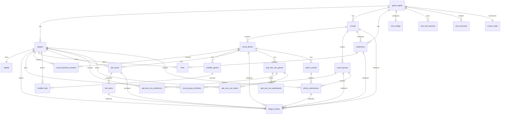

# Market Mayhem Database

## Core model

## `game_nights`

Tenant/game boundary. Stores game name, starting balance, optional prediction wallet-percentage cap, current round/block, current screen mode and monotonic `game_state_version`.

The old game-level prediction duration/minimum/maximum columns were introduced by migration 0005. Migration 0006 leaves them in place only for safe upgrades; current product code does not read them for market configuration or validation.

## Players, wallets and ledger

`players.active=false` is used for deactivation so financial history remains intact. `players.starting_balance_snapshot` stores the immutable configured starting balance that applied when that player was created; it is not reconstructed from later Settings changes and remains exact even when the starting balance was zero. `wallets.current_balance` is **available** balance. Unresolved prediction/roulette stakes are tracked by active bet rows and are added back when calculating total player value.

`ledger_entries` is immutable. Relevant attribution columns include:

- `attributed_round_id`
- `prediction_id` / `bet_id`
- `roulette_game_id` / `roulette_bet_id`
- `round_group_id`
- `round_block_id`

Manual/group reasons are stored as exact descriptions. Corrections create new ledger rows.

## Rounds and blocks

`rounds` have `UPCOMING`, `ACTIVE`, `COMPLETED`. A partial unique index from migration 0004 enforces at most one active round per game.

`round_blocks` has game/round/type/order/title/JSON payload plus interactive timestamps/status. Migration 0006 expanded allowed types to `TEXT`, `QUESTION`, `DUOLINGO_QUESTION`, `ROULETTE`; migration 0007 adds `PICTURE`, `MUSIC`, `BUZZER`, `WAGER`; migration 0010 adds `SLOTMACHINE`; migration 0013 adds `PAK_EEN_ZES`; migration 0015 adds `FOTORONDE`.

Payload keys for the types added by 0007. Media blocks store only a Netlify Blobs **key**, never the bytes — the payload travels in every admin-state snapshot, so embedding a file would bloat each poll response:

- `PICTURE` — `imageKey`
- `MUSIC` — `audioKey`, `audioName` (original filename, Admin-facing only; the block title is the song title and stays hidden until reveal)
- `WAGER` — `correctAnswer`

Payload keys for the type added by 0010:

- `SLOTMACHINE` — `maxSpins` (per series), `allowedPlayerIds` (empty array means everyone), plus `body` as the instruction text shown on phones. The reel artwork and the outcome distribution are **not** here: they are game-wide and live in their own tables.
- `FOTORONDE` — `subjects` as `{key, label}` pairs (defaulting to the standard six) plus `body` as the instruction text shown on phones. The key is the identity a submission is filed under, so renaming a subject keeps its photos.
- `PAK_EEN_ZES` — `body` only, as the instruction text shown on phones. There is nothing else to author: the deck is a fixed 52 cards, the game ends on the fourth six, every active player takes part, and the turn order is frozen when the host starts.

`BUZZER` and `WAGER` are authorable and presentable but have no phone-side interaction and no live state machine, matching the Admin UX redesign, which specifies none for them. `blockMeta.ts` marks this with `interactive: false`.

## Slotmachine

Migration 0010 adds five tables, split by what each thing is scoped to.

### Configuration (game-wide)

- `slot_configs` — one row per game night holding `total_weight`, the denominator the Admin sets. Percentages are `weight / total_weight x 100`, and a configuration is valid only when the weights sum to exactly this number.
- `slot_reel_symbols` — primary key `(game_night_id, position)` with `position` 1–12: one shared set of twelve symbols used by all three reels. Stores a Netlify Blobs `media_key`, never the bytes, because the artwork rides along in the Admin and Big Screen snapshots, which are polled all evening. Migration `0010` originally keyed this by `(game_night_id, reel, position)` for 36 slots; `0011` dropped `reel` and collapsed the rows, keeping for each position the artwork from the lowest-numbered reel that had any.
- `slot_outcome_types` — the five fixed categories, keyed `(game_night_id, outcome_type)`, each with a `weight` and a `payout_multiplier`. A CHECK pins the allowed types, and a second CHECK forces `NO_WIN` to a zero payout so a paying no-win cannot exist even by hand-editing. Seeded per game with `60 / 20 / 10 / 7 / 3` at `0 / 1.4 / 1.8 / 3 / 5x`, so a fresh game starts valid. Migration `0012` created this and dropped the previous `slot_outcomes`, which held a chance and payout per *specific* symbol combination — the idea being removed.

### Play (per player, per block)

- `slot_series` — one locked reeks: `stake_per_spin`, `total_spins`, `spins_remaining`, `total_stake`, `refunded_spins` and `ACTIVE`/`COMPLETED`/`CANCELLED`. A partial unique index allows at most one `ACTIVE` series per `(round_block_id, player_id)`. `CHECK (spins_remaining <= total_spins)` and `CHECK (spins_remaining >= 0)` are what stop a replayed or racing SPIN from manufacturing spins or driving the counter negative.
- `slot_spins` — the outcome the server chose, with `spin_number`, `outcome_type` (the category drawn and verified), `grid` (the whole 3x3 field as `{p: position, k: media key}` cells), `win_cells` (the `[row, column]` pairs the projector highlights), `stake`, `payout_multiplier`, `payout` and `SPINNING`/`RESULT`. The `reel1/2/3_position` and `media_key` columns keep their meaning as the **main row** — the row that decides the two-alike categories. Media keys are snapshotted in `grid` too, because Settings can be re-uploaded later in the evening and history must still show the symbols the room actually saw. Unique on `(slot_series_id, spin_number)` and on `(slot_series_id, idempotency_key)` — the second is what answers a double-tapped SPIN with the spin it already produced.

### Ledger attribution

`ledger_entries` gains `slot_series_id` and `slot_spin_id`, and money moves only here and in `wallets` — there is no separate slotmachine balance. Partial unique indexes enforce one stake and at most one refund per series, and at most one payout per spin:

- `SLOT_STAKE` — the whole series total, debited at lock.
- `SLOT_PAYOUT` — one per winning spin, credited in the same transaction that chose the outcome.
- `SLOT_REFUND` — the unspun remainder, when a series is closed by a block change or round completion.

Deleting a round block or a round is refused once slot series exist, the same rule roulette history has. Player rows cascade, so deactivation (not deletion) remains the route for leaving history intact.

## Pak een Zes

Migration 0013 adds four tables; migration 0014 adds the scoring on top.

- `pak_een_zes_games` — one game per block: `status` (`READY`/`PREDICTING`/`LOCKED`/`DRAWING`/`FINISHED`/`CANCELLED`) and `turn_index`, which walks the turn order and wraps. A partial unique index allows only one live game per block, so re-showing a block cannot silently start a second one.
- `pak_een_zes_participants` — the turn order, frozen at START. Stored rather than derived so a player joining or leaving mid-game cannot reshuffle whose turn it is. Unique on both `(game, player)` and `(game, turn_order)`.
- `pak_een_zes_predictions` — four ordered picks per player, **one row per slot**, keyed `(game, player, slot)`. Per slot precisely because duplicates are allowed: `Daan, Twan, Daan, Bas` must stay four picks rather than collapse to three names, and picking yourself is allowed so there is no constraint against it. An extra index on `(game, predicted_player_id)` answers "who did people back?" for scoring without a scan.
- `pak_een_zes_draws` — every card that left the deck, in order, with who drew it. Three unique constraints carry the game's guarantees: `(game, rank, suit)` means a card leaves the deck exactly once, `(game, draw_number)` keeps the sequence honest, and `(game, idempotency_key)` answers a double-tapped KAART PAKKEN with the card it already produced. A CHECK ties `is_six` to `rank = '6'`, so a six event can never be recorded against a non-six. A partial index on `(game_night_id, player_id) WHERE is_six` is what makes the scoring question — who drew a six, which suit, on which draw, how often — cheap.

The drawn rows *are* the deck's history: what remains is derived from them, never from a shuffled list held in memory.

Scoring (migration 0014):

- `game_nights.pak_een_zes_points_per_correct` — one game-wide amount per correct prediction, defaulting to 25.
- `pak_een_zes_games.points_per_correct` — the rate that game actually paid, snapshotted when it finishes, so a later Settings change never rewrites history. Null until it pays.
- `ledger_entries.pak_een_zes_game_id` — attribution for the `PAK_EEN_ZES_REWARD` rows, with a partial unique index on `(pak_een_zes_game_id, player_id)` that makes a double payout impossible rather than unlikely.

Correct predictions are a multiset match, so a name picked twice can score twice when that player drew two sixes, and scores once when they drew one.

## Fotoronde

Migration 0015 adds two tables. "Team" means a **round group**: `round_group_members` is unique by `(round_id, player_id)`, so a player's team is derivable from their session rather than sent by their phone. The legacy `teams` table is untouched and unread.

- `photo_rounds` — one per block, with `status` (`DRAFT`/`OPEN`/`CLOSED`/`COMPLETED`) and its phase timestamps. A unique index on `round_block_id` allows exactly one for the life of the block: unlike the other games there is no "start over", because the photos and the credits awarded for them are history.
- `photo_submissions` — one photo per team per subject, keyed `(photo_round_id, subject_key, group_id)` by a unique constraint. That constraint *is* the "one active submission per team per subject" rule; replacing upserts the row rather than inserting a second. `group_id` cascades with the group (a photo for a team that no longer exists has nobody to pay), while `uploaded_by` is `ON DELETE SET NULL` so removing a player never erases their team's photo or the credits it earned. Only the Netlify Blobs `media_key` is stored, never the bytes. A partial index on `credits_awarded IS NULL` carries the Admin's unjudged working list.

`ledger_entries.photo_submission_id` attributes the `PHOTO_ROUND_REWARD` rows, with a partial unique index on `(photo_submission_id, player_id)` that makes a double payout impossible rather than unlikely. Credits are real coins in wallets — there is no second currency.

Credits are split across the team's active members as `floor(credits / members)` with the remainder handed out one credit at a time, so the amounts always sum to exactly what was awarded. The split shown for a judged photo is read back from those ledger rows rather than recomputed, because team membership can change after an award.

## Screen state

`screen_state` holds one row per game with the **live** pointer (`mode`, `round_id`, `prediction_id`, `payload.blockId`). Migration 0008 adds two parallel sets:

- `staged_*` — what the Admin has selected but not yet shown. `GO LIVE` promotes it to live, then advances the staged pointer to the next run-of-show step.
- `previous_*` — what `BACK TO RUN OF SHOW` restores after temporarily showing the market dashboard. Presentation mode is separate from game state: showing the dashboard must not change the active round or block, pause timers or settle anything.

They are columns on the existing row rather than a second table, so `getAdminState` reads them from the `screen_state` query it already runs, at no extra query cost.

## Prediction requests

`prediction_requests` (migration 0009) holds player-proposed markets: `PENDING` → `APPROVED` / `DENIED` with a mandatory reason on denial (enforced by `prediction_requests_denied_reason_check`).

Approval does **not** create a market. The player-facing copy is "Approved · waiting for prediction to go live", so approval only signals intent; the Admin still authors the market with its own odds and stake limits. The per-player limits — at most 2 requests, and one hour between submissions — are enforced in the endpoint rather than by constraints, because both are relative to the requesting player and need to return a usable error rather than a constraint violation.

For a Duolingo block the JSON payload contains supporting text, answer texts, correct index, reward and an optional `contextImageKey` — the Netlify Blobs key of the question's context photo, never the bytes, which would ride along in every poll. Player-facing query normalization is what prevents secret data from leaving the server before reveal: both the correct index and the photo key are withheld until `REVEALED`.

Because the photo lives in the block payload, Full Reset keeps it: the played answers are deleted and the block returns to `READY`, but the question, its answers and its photo are configuration and survive.

## Round groups

Migration 0006 adds:

- `round_groups`
- `round_group_members`

Membership is unique per `(round_id, player_id)`, so a player belongs to at most one group within the same round. Group adjustments do not use a shared wallet; they create individual ledger entries.

## Live question answers

`round_question_answers` stores only the selected answer index and submission timestamp. `(round_block_id, player_id)` is unique, enforcing one response per player/question server-side.

Question rewards use `ledger_entries.round_block_id` and a partial unique index on `(round_block_id, player_id, transaction_type='QUESTION_REWARD')` to prevent double rewards.

## Predictions and bets

Migration 0005 removed the obsolete crowd-vote table/columns and moved to `DRAFT/SCHEDULED/OPEN/LOCKED/RESULT/SETTLED/CANCELLED`.

Migration 0006 adds market-owned:

- `probability_yes`
- `prediction_time_seconds`
- `minimum_stake`
- `maximum_stake`

`yes_odds` and `no_odds` are persisted multipliers derived from probability for new/edited markets. `bets` is unique by `(prediction_id, player_id)` and snapshots `odds_snapshot` + `potential_return`.

`PREDICTION_DEPOSIT` ledger rows move stake from available balance into the logical locked bucket. Final payout/refund ledger rows close the accounting lifecycle.

## Roulette

`roulette_games` now supports `SPINNING` between `LOCKED` and `RESULT`; `result_number` is stored by the server before animation. `roulette_bets` stores normalized type/selection, stake, payout multiplier snapshot, potential return and final status. A partial unique index permits only one financially live roulette game per game night.

## Screen state

`screen_state` contains the current public presentation. Round/prediction references use typed columns; block/roulette identifiers are carried in its JSON payload. Presentation state is independent from whether a prediction market is open.

## Authentication and audit

`player_join_tokens`, `player_sessions` and `admin_sessions` store digests rather than raw secrets. Session digests are HMAC-protected using `SESSION_SECRET`.

`admin_audit_log` is operational history rather than wallet history. Game reset deliberately preserves this table and inserts a final `GAME_RESET` event before cleanup. Full Reset preserves it for the same reason and writes a `FULL_RESET` event carrying the per-table delete counts — after the reset that entry is the only record the played evening ever happened.

## Runtime vs configuration

Full Reset splits every table in this schema into two groups, listed explicitly as `RUNTIME_TABLES` and `PRESERVED_TABLES` in `netlify/lib/full-reset.ts`:

- **Runtime** — what playing the evening produced: `ledger_entries`, `bets`, `roulette_games`/`roulette_bets`, `slot_series`/`slot_spins`, the four `pak_een_zes_*` tables, `photo_rounds`/`photo_submissions`, `round_question_answers`, `prediction_requests`, and the legacy `player_timers`/`player_codewords`. Deleted, children before parents.
- **Configuration** — what the Admin prepared: `rounds`, `round_blocks` and their payloads, `round_groups`/`round_group_members`, `predictions`, `slot_configs`/`slot_reel_symbols`/`slot_outcome_types`, `players`, `wallets`, `player_join_tokens`, `player_sessions`, `game_nights`, `screen_state`, `admin_sessions`, `admin_audit_log`. Kept, with any runtime columns reset in place.

**A new table must be added to one of those two lists.** `tests/full-reset.test.ts` reads the live table set out of the migrations in this directory and fails when a table appears in neither — an unclassified table is one whose test data would silently survive a reset, or whose configuration would silently be wiped by one.

Four tables have no `game_night_id` of their own and are scoped through their parent, so a reset never reaches another game night: `pak_een_zes_predictions` and `pak_een_zes_participants` via `pak_een_zes_games`, `roulette_bets` via `roulette_games`, and `bets` via `predictions`.

## Migration strategy

- `0001`–`0004`: historical schema/demo/state-integrity history; never rewrite once deployed.
- `0005_full_game_model.sql`: removes crowd voting, adds round blocks/roulette/settings/screen model.
- `0006_backlog_interactive_models.sql`: per-prediction probability/timing/stakes, Duolingo question state/answers, round groups, roulette `SPINNING`, richer ledger attribution.
- `0007_round_block_types.sql`: widens `round_blocks.type` to also allow `PICTURE`, `MUSIC`, `BUZZER`, `WAGER`.
- `0008_staged_screen.sql`: `staged_*` and `previous_*` columns on `screen_state` for the Admin presenter model.
- `0009_prediction_requests.sql`: `prediction_requests` table for player-proposed markets.
- `0010_slotmachine.sql`: slotmachine configuration/series/spin tables, slot ledger attribution, `SLOTMACHINE` added to `round_blocks.type` and to the live/staged/previous `screen_state` mode constraints. Opens by dropping the abandoned `0007_slot_machine` schema, which collides with it by name.
- `0011_shared_slot_symbols.sql`: collapses `slot_reel_symbols` from 3 x 12 to one shared set of 12, so each symbol is uploaded once instead of three times.
- `0012_slot_outcome_types.sql`: replaces per-combination chances with the five fixed outcome types, drops `slot_outcomes`, and adds `outcome_type` / `grid` / `win_cells` to `slot_spins`. Payouts now belong to patterns rather than to particular images.
- `0013_pak_een_zes.sql`: Pak een Zes games, participants, predictions and draws, plus `PAK_EEN_ZES` added to `round_blocks.type` and to the live/staged/previous `screen_state` mode constraints.
- `0014_pak_een_zes_scoring.sql`: the Admin-set points per correct prediction, the per-game rate snapshot, and `PAK_EEN_ZES_REWARD` ledger attribution with a one-reward-per-player index.
- `0015_photo_round.sql`: Fotoronde rounds and submissions, `PHOTO_ROUND_REWARD` ledger attribution with a one-reward-per-player index, and `FOTORONDE` added to `round_blocks.type` and to the live/staged/previous `screen_state` mode constraints.

Unrelated legacy schema (`teams`, `players.team_id`, avatar/admin-note fields, codewords/timers, session `last_seen_at`, correction link) remains for upgrade safety even though current production UI does not use it.
