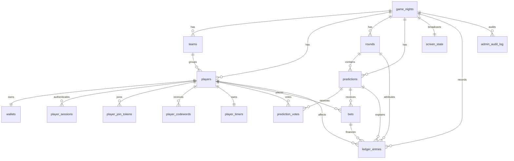

# Market Mayhem Database

## ERD

## Key tables

### game_nights
Top-level event boundary. Nearly all state belongs to a `game_night_id`. Holds the current round, screen mode, starting balance, and monotonic state version.

### players / teams
Players may belong to one team. Wallets remain individual in v1.

### wallets / ledger_entries
`wallets` stores the transactionally maintained current balance. `ledger_entries` is immutable history. Corrections use `correction_of_entry_id` and a new amount row rather than editing old rows.

### rounds
`round_number` is not execution order. `started_at`/`completed_at` define actual chronology.

### predictions / prediction_votes / bets
Predictions implement the server-owned state machine. Votes are unique per player/prediction and private. Bets are unique per player/prediction and store an odds snapshot.

### screen_state
Explicitly selects the Big Screen composition.

### player_join_tokens / player_sessions / admin_sessions
Opaque authentication records. Raw player/admin session tokens are never stored.

### player_codewords / player_timers
Admin-only codeword history and low-write timer state. Timer countdown visuals are computed locally between database mutations.

### admin_audit_log
Operational history separate from the financial ledger.

## Integrity checks

The Admin diagnostics endpoint includes a wallet verification query comparing cached wallet values with ledger sums. A mismatch is treated as a serious integrity warning.
