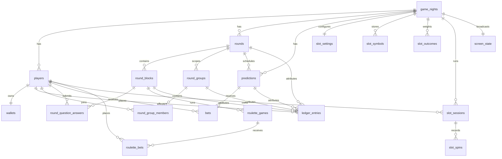

# Market Mayhem Database

## Core model

## `game_nights`

Tenant/game boundary. Stores game name, starting balance, optional prediction wallet-percentage cap, current round/block, current screen mode and monotonic `game_state_version`.

The old game-level prediction duration/minimum/maximum columns were introduced by migration 0005. Migration 0006 leaves them in place only for safe upgrades; current product code does not read them for market configuration or validation.

## Players, wallets and ledger

`players.active=false` is used for deactivation so financial history remains intact. `players.starting_balance_snapshot` stores the immutable configured starting balance that applied when that player was created; it is not reconstructed from later Settings changes and remains exact even when the starting balance was zero. `wallets.current_balance` is **available** balance. Unresolved prediction/roulette stakes are tracked by active bet rows, and unused slot spins by `slot_sessions.remaining_spins x stake_per_spin`; both are added back when calculating total player value.

`ledger_entries` is immutable. Relevant attribution columns include:

- `attributed_round_id`
- `prediction_id` / `bet_id`
- `roulette_game_id` / `roulette_bet_id`
- `round_group_id`
- `round_block_id`
- `slot_session_id` / `slot_spin_id`

Manual/group reasons are stored as exact descriptions. Corrections create new ledger rows.

## Rounds and blocks

`rounds` have `UPCOMING`, `ACTIVE`, `COMPLETED`. A partial unique index from migration 0004 enforces at most one active round per game.

`round_blocks` has game/round/type/order/title/JSON payload plus interactive timestamps/status. Migration 0006 expands allowed types to `TEXT`, `QUESTION`, `DUOLINGO_QUESTION`, `ROULETTE`.

For a Duolingo block the JSON payload contains answer texts, correct index and reward. Player-facing query normalization is what prevents secret data from leaving the server before reveal.

## Round groups

Migration 0006 adds:

- `round_groups`
- `round_group_members`

Membership is unique per `(round_id, player_id)`, so a player belongs to at most one group within the same round. Group adjustments do not use a shared wallet; they create individual ledger entries.

## Live question answers

`round_question_answers` stores only the selected answer index and submission timestamp. `(round_block_id, player_id)` is unique, enforcing one response per player/question server-side.

Question rewards use `ledger_entries.round_block_id` and a partial unique index on `(round_block_id, player_id, transaction_type='QUESTION_REWARD')` to prevent double rewards.

## Predictions and bets

Migration 0005 removed the obsolete crowd-vote table/columns and moved to `DRAFT/SCHEDULED/OPEN/LOCKED/RESULT/SETTLED/CANCELLED`.

Migration 0006 adds market-owned:

- `probability_yes`
- `prediction_time_seconds`
- `minimum_stake`
- `maximum_stake`

`yes_odds` and `no_odds` are persisted multipliers derived from probability for new/edited markets. `bets` is unique by `(prediction_id, player_id)` and snapshots `odds_snapshot` + `potential_return`.

`PREDICTION_DEPOSIT` ledger rows move stake from available balance into the logical locked bucket. Final payout/refund ledger rows close the accounting lifecycle.

## Roulette

`roulette_games` now supports `SPINNING` between `LOCKED` and `RESULT`; `result_number` is stored by the server before animation. `roulette_bets` stores normalized type/selection, stake, payout multiplier snapshot, potential return and final status. A partial unique index permits only one financially live roulette game per game night.

## Slot machine

Migration 0007 adds five tables.

`slot_settings` is one row per game: total probability pool, maximum spins per series and the minimum/maximum stake per spin. It is created lazily, so games from before 0007 and games created after it behave identically.

`slot_symbols` stores the reel artwork as `BYTEA` with a checksum, unique by `(game_night_id, reel, symbol_position)` for reels 1–3 and positions 1–12. PNG is the only accepted type and 1 MB the hard ceiling, enforced by both the endpoint and a CHECK constraint. Images are never part of a state snapshot; `/api/slot-symbol` serves them and the checksum is the cache key.

`slot_outcomes` is unique by `(game_night_id, reel1_position, reel2_position, reel3_position)` and stores `weight` (chances out of the pool) plus `payout_multiplier`. Storage is sparse: a combination with neither a weight nor a payout is deleted rather than written as an empty row, so the 1728-combination space costs only what is actually configured. A partial index covers the `weight > 0` rows the randomizer walks.

`slot_sessions` holds stake per spin, original spins, remaining spins, total stake and `ACTIVE/COMPLETED/CANCELLED`. A partial unique index allows one `ACTIVE` series per game night. `slot_spins` records every draw with its three reel positions, multiplier, payout and `SPINNING/RESULT`, unique by `(slot_session_id, spin_number)`.

Money movement uses `SLOT_DEPOSIT` (whole series stake at lock-in), `SLOT_PAYOUT` (per winning spin) and `SLOT_REFUND` (unspun stake on an Admin cancellation). Partial unique indexes on `slot_spin_id` and `slot_session_id` per transaction type prevent duplicate payouts and refunds on top of the existing idempotency-key index.

## Screen state

`screen_state` contains the current public presentation. Round/prediction references use typed columns; block/roulette identifiers are carried in its JSON payload. Presentation state is independent from whether a prediction market is open.

## Authentication and audit

`player_join_tokens`, `player_sessions` and `admin_sessions` store digests rather than raw secrets. Session digests are HMAC-protected using `SESSION_SECRET`.

`admin_audit_log` is operational history rather than wallet history. Game reset deliberately preserves this table and inserts a final `GAME_RESET` event before cleanup.

## Migration strategy

- `0001`–`0004`: historical schema/demo/state-integrity history; never rewrite once deployed.
- `0005_full_game_model.sql`: removes crowd voting, adds round blocks/roulette/settings/screen model.
- `0006_backlog_interactive_models.sql`: per-prediction probability/timing/stakes, Duolingo question state/answers, round groups, roulette `SPINNING`, richer ledger attribution.
- `0007_slot_machine.sql`: slot settings, reel symbol storage, weighted outcome distribution with payouts, player spin series/spins and slot ledger attribution.

Unrelated legacy schema (`teams`, `players.team_id`, avatar/admin-note fields, codewords/timers, session `last_seen_at`, correction link) remains for upgrade safety even though current production UI does not use it.
