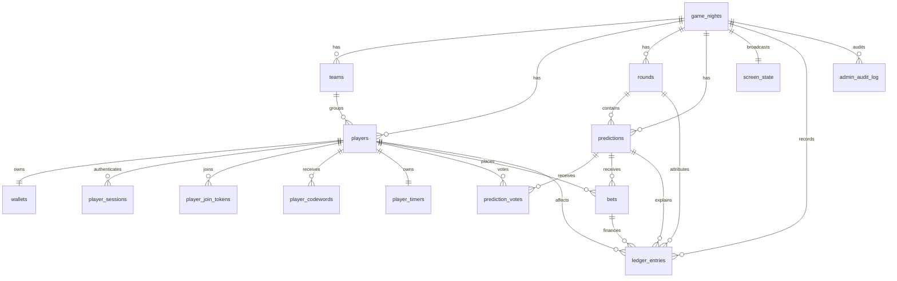

# Market Mayhem Database

## ERD

## Key tables

### game_nights
Top-level event boundary. Nearly all state belongs to a `game_night_id`. Holds the current round, screen mode, starting balance, and monotonic state version.

### players / teams
The schema supports optional teams, but the current UI/API does not manage team membership. Wallets are individual in the active v1 feature set.

### wallets / ledger_entries
`wallets` stores the transactionally maintained current balance. `ledger_entries` is immutable history. The schema supports linking a compensating entry through `correction_of_entry_id`; the current admin adjustment UI writes a new immutable adjustment but does not populate that optional correction link.

### rounds
`round_number` is not execution order. `started_at`/`completed_at` define actual chronology. Application checks plus a partial unique index enforce at most one `ACTIVE` round per game.

### predictions / prediction_votes / bets
Predictions implement the server-owned state machine. Votes are unique per player/prediction and private. Bets are unique per player/prediction and store an odds snapshot.

### screen_state
Explicitly selects the Big Screen composition.

### player_join_tokens / player_sessions / admin_sessions
Opaque authentication records. Raw player/admin session tokens are never stored.

### player_codewords / player_timers
These tables remain in the original schema as reserved/prototype structures, but the current application has no codeword or timer UI/API and does not write new timer rows. They are not part of the active v1 feature set.

### admin_audit_log
Operational history separate from the financial ledger.

## Integrity checks

Wallet writes are transactionally maintained alongside immutable ledger entries. The current UI does not expose a dedicated diagnostics endpoint; direct operational checks should compare each wallet balance with the sum of that player's ledger entries.
