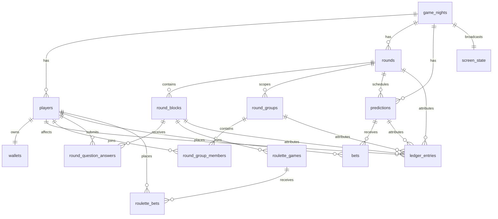

# Market Mayhem Database

## Core model

## `game_nights`

Tenant/game boundary. Stores game name, starting balance, optional prediction wallet-percentage cap, current round/block, current screen mode and monotonic `game_state_version`.

The old game-level prediction duration/minimum/maximum columns were introduced by migration 0005. Migration 0006 leaves them in place only for safe upgrades; current product code does not read them for market configuration or validation.

## Players, wallets and ledger

`players.active=false` is used for deactivation so financial history remains intact. `players.starting_balance_snapshot` stores the immutable configured starting balance that applied when that player was created; it is not reconstructed from later Settings changes and remains exact even when the starting balance was zero. `wallets.current_balance` is **available** balance. Unresolved prediction/roulette stakes are tracked by active bet rows and are added back when calculating total player value.

`ledger_entries` is immutable. Relevant attribution columns include:

- `attributed_round_id`
- `prediction_id` / `bet_id`
- `roulette_game_id` / `roulette_bet_id`
- `round_group_id`
- `round_block_id`

Manual/group reasons are stored as exact descriptions. Corrections create new ledger rows.

## Rounds and blocks

`rounds` have `UPCOMING`, `ACTIVE`, `COMPLETED`. A partial unique index from migration 0004 enforces at most one active round per game.

`round_blocks` has game/round/type/order/title/JSON payload plus interactive timestamps/status. Migration 0006 expanded allowed types to `TEXT`, `QUESTION`, `DUOLINGO_QUESTION`, `ROULETTE`; migration 0007 adds `PICTURE`, `MUSIC`, `BUZZER`, `WAGER`.

Payload keys for the types added by 0007. Media blocks store only a Netlify Blobs **key**, never the bytes — the payload travels in every admin-state snapshot, so embedding a file would bloat each poll response:

- `PICTURE` — `imageKey`
- `MUSIC` — `audioKey`, `audioName` (original filename, Admin-facing only; the block title is the song title and stays hidden until reveal)
- `WAGER` — `correctAnswer`

`BUZZER` and `WAGER` are authorable and presentable but have no phone-side interaction and no live state machine, matching the Admin UX redesign, which specifies none for them. `blockMeta.ts` marks this with `interactive: false`.

## Screen state

`screen_state` holds one row per game with the **live** pointer (`mode`, `round_id`, `prediction_id`, `payload.blockId`). Migration 0008 adds two parallel sets:

- `staged_*` — what the Admin has selected but not yet shown. `GO LIVE` promotes it to live, then advances the staged pointer to the next run-of-show step.
- `previous_*` — what `BACK TO RUN OF SHOW` restores after temporarily showing the market dashboard. Presentation mode is separate from game state: showing the dashboard must not change the active round or block, pause timers or settle anything.

They are columns on the existing row rather than a second table, so `getAdminState` reads them from the `screen_state` query it already runs, at no extra query cost.

## Prediction requests

`prediction_requests` (migration 0009) holds player-proposed markets: `PENDING` → `APPROVED` / `DENIED` with a mandatory reason on denial (enforced by `prediction_requests_denied_reason_check`).

Approval does **not** create a market. The player-facing copy is "Approved · waiting for prediction to go live", so approval only signals intent; the Admin still authors the market with its own odds and stake limits. The per-player limits — at most 2 requests, and one hour between submissions — are enforced in the endpoint rather than by constraints, because both are relative to the requesting player and need to return a usable error rather than a constraint violation.

For a Duolingo block the JSON payload contains answer texts, correct index and reward. Player-facing query normalization is what prevents secret data from leaving the server before reveal.

## Round groups

Migration 0006 adds:

- `round_groups`
- `round_group_members`

Membership is unique per `(round_id, player_id)`, so a player belongs to at most one group within the same round. Group adjustments do not use a shared wallet; they create individual ledger entries.

## Live question answers

`round_question_answers` stores only the selected answer index and submission timestamp. `(round_block_id, player_id)` is unique, enforcing one response per player/question server-side.

Question rewards use `ledger_entries.round_block_id` and a partial unique index on `(round_block_id, player_id, transaction_type='QUESTION_REWARD')` to prevent double rewards.

## Predictions and bets

Migration 0005 removed the obsolete crowd-vote table/columns and moved to `DRAFT/SCHEDULED/OPEN/LOCKED/RESULT/SETTLED/CANCELLED`.

Migration 0006 adds market-owned:

- `probability_yes`
- `prediction_time_seconds`
- `minimum_stake`
- `maximum_stake`

`yes_odds` and `no_odds` are persisted multipliers derived from probability for new/edited markets. `bets` is unique by `(prediction_id, player_id)` and snapshots `odds_snapshot` + `potential_return`.

`PREDICTION_DEPOSIT` ledger rows move stake from available balance into the logical locked bucket. Final payout/refund ledger rows close the accounting lifecycle.

## Roulette

`roulette_games` now supports `SPINNING` between `LOCKED` and `RESULT`; `result_number` is stored by the server before animation. `roulette_bets` stores normalized type/selection, stake, payout multiplier snapshot, potential return and final status. A partial unique index permits only one financially live roulette game per game night.

## Screen state

`screen_state` contains the current public presentation. Round/prediction references use typed columns; block/roulette identifiers are carried in its JSON payload. Presentation state is independent from whether a prediction market is open.

## Authentication and audit

`player_join_tokens`, `player_sessions` and `admin_sessions` store digests rather than raw secrets. Session digests are HMAC-protected using `SESSION_SECRET`.

`admin_audit_log` is operational history rather than wallet history. Game reset deliberately preserves this table and inserts a final `GAME_RESET` event before cleanup.

## Migration strategy

- `0001`–`0004`: historical schema/demo/state-integrity history; never rewrite once deployed.
- `0005_full_game_model.sql`: removes crowd voting, adds round blocks/roulette/settings/screen model.
- `0006_backlog_interactive_models.sql`: per-prediction probability/timing/stakes, Duolingo question state/answers, round groups, roulette `SPINNING`, richer ledger attribution.
- `0007_round_block_types.sql`: widens `round_blocks.type` to also allow `PICTURE`, `MUSIC`, `BUZZER`, `WAGER`.
- `0008_staged_screen.sql`: `staged_*` and `previous_*` columns on `screen_state` for the Admin presenter model.
- `0009_prediction_requests.sql`: `prediction_requests` table for player-proposed markets.

Unrelated legacy schema (`teams`, `players.team_id`, avatar/admin-note fields, codewords/timers, session `last_seen_at`, correction link) remains for upgrade safety even though current production UI does not use it.
