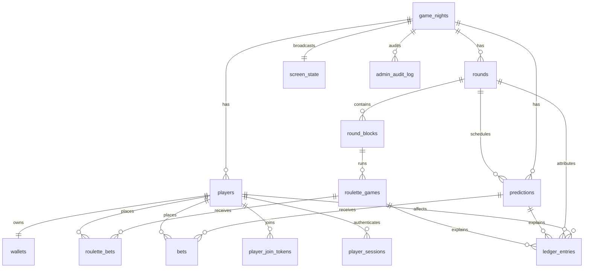

# Market Mayhem Database

## Current model

## `game_nights`

Top-level tenant boundary. Stores current round/block, broadcast mode, monotonic live version and per-game settings: starting balance, prediction duration, min/max prediction stake and optional wallet-percentage cap.

## `players`, `wallets`, `ledger_entries`

Players use soft deactivation (`active=false`) so financial history is retained. A wallet stores current balance; the ledger is immutable history. Ledger entries may reference a round, prediction/bet or roulette game/bet and include the exact Admin adjustment reason.

## `rounds`, `round_blocks`

Round number is display metadata, not an execution dependency. `round_blocks.sort_order` defines content order. Blocks are `TEXT`, `QUESTION` or `ROULETTE`; text/supporting content is kept in JSON `payload` so block configuration can grow without schema churn.

## `predictions`, `bets`

Current prediction columns include game, optional round, question, status, YES/NO odds, open/close timestamps, result and settlement time. The old crowd-vote columns/table are removed by migration `0005_full_game_model.sql`.

Bets are unique by `(prediction_id, player_id)` and preserve `odds_snapshot` and `potential_return`.

## `roulette_games`, `roulette_bets`

A roulette game belongs to a game night and optionally a round/block. Bets store normalized type/selection, stake, payout multiplier snapshot, potential return and final status.

## `screen_state`

Explicit projector state. `payload` carries composition-specific non-financial identifiers such as the current round block/roulette game while typed foreign keys cover round/prediction references.

## Authentication tables

`player_join_tokens`, `player_sessions` and `admin_sessions` store only token digests. Session digests are HMAC-protected with `SESSION_SECRET`; raw session values exist only in HttpOnly cookies.

## `admin_audit_log`

Operational audit events are separate from money. Game reset deliberately preserves audit history and writes a final `GAME_RESET` event before destructive cleanup.

## Migrations

Migrations `0001`–`0004` remain historical because they may already be deployed. `0005_full_game_model.sql` transitions legacy prediction states/data, removes obsolete crowd-voting schema, adds Settings, round blocks, roulette and ledger links, and updates projector modes without rewriting deployed history.

## Retained legacy schema

Migration `0005` intentionally leaves unrelated historical columns/tables such as `teams`, `players.team_id`, `players.avatar_data`, `players.admin_notes`, `player_codewords`, `player_timers`, session `last_seen_at`, and `ledger_entries.correction_of_entry_id` in place. The current product does not read them, but removing unrelated historical data during an upgrade would be destructive. An explicit **Delete Game Save** does clear game-owned legacy player/team data through normal foreign-key cascades and targeted team deletion.
