# Market Mayhem Database

## Core model

```mermaid
erDiagram
  game_nights ||--o{ players : has
  players ||--|| wallets : owns
  players ||--o{ ledger_entries : affects
  game_nights ||--o{ rounds : has
  rounds ||--|| round_runtime : "tracks progress in"
  rounds ||--o{ round_groups : scopes
  round_groups ||--o{ round_group_members : contains
  players ||--o{ round_group_members : joins

  rounds ||--o{ live_quiz_questions : "LIVE_QUIZ authors"
  live_quiz_questions ||--o{ live_quiz_question_options : offers
  live_quiz_questions ||--|| live_quiz_question_state : "runs as"
  live_quiz_questions ||--o{ quiz_answers : receives
  live_quiz_question_options ||--o{ quiz_answers : "is picked by"
  players ||--o{ quiz_answers : submits
  live_quiz_questions ||--o{ ledger_entries : attributes

  rounds ||--o{ presentation_slides : "PRESENTATIE authors"
  presentation_slides ||--|| presentation_slide_state : "runs as"

  rounds ||--o{ fotoronde_subjects : "FOTORONDE authors"
  rounds ||--o{ photo_rounds : "FOTORONDE runs"
  photo_rounds ||--o{ photo_submissions : collects
  round_groups ||--o{ photo_submissions : submits
  players ||--o{ photo_submissions : uploads
  photo_submissions ||--o{ ledger_entries : attributes

  rounds ||--|| slotmachine_rounds : "SLOTMACHINE configures"
  rounds ||--o{ slotmachine_round_participants : allows
  rounds ||--o{ slot_series : "SLOTMACHINE runs"
  game_nights ||--|| slot_configs : configures
  game_nights ||--o{ slot_reel_symbols : owns
  game_nights ||--o{ slot_outcome_types : weights
  players ||--o{ slot_series : locks
  slot_series ||--o{ slot_spins : produces
  slot_series ||--o{ ledger_entries : attributes
  slot_spins ||--o{ ledger_entries : attributes

  rounds ||--o{ roulette_games : "ROULETTE runs"
  roulette_games ||--o{ roulette_bets : receives
  players ||--o{ roulette_bets : places

  rounds ||--o{ pak_een_zes_games : "PAK_EEN_ZES runs"
  pak_een_zes_games ||--o{ pak_een_zes_participants : orders
  pak_een_zes_games ||--o{ pak_een_zes_predictions : collects
  pak_een_zes_games ||--o{ pak_een_zes_draws : records
  players ||--o{ pak_een_zes_predictions : submits
  players ||--o{ pak_een_zes_draws : draws

  game_nights ||--o{ predictions : has
  rounds ||--o{ predictions : schedules
  predictions ||--o{ bets : receives
  players ||--o{ bets : places
  rounds ||--o{ ledger_entries : attributes
  predictions ||--o{ ledger_entries : attributes
  round_groups ||--o{ ledger_entries : attributes
  game_nights ||--|| screen_state : broadcasts
```



## `game_nights`

Tenant/game boundary. Stores game name, starting balance, optional prediction wallet-percentage cap, current round/block, current screen mode and monotonic `game_state_version`.

The old game-level prediction duration/minimum/maximum columns were introduced by migration 0005. Migration 0006 leaves them in place only for safe upgrades; current product code does not read them for market configuration or validation.

## Players, wallets and ledger

`players.active=false` is used for deactivation so financial history remains intact. `players.starting_balance_snapshot` stores the immutable configured starting balance that applied when that player was created; it is not reconstructed from later Settings changes and remains exact even when the starting balance was zero. `players.seed_key` marks one of the ten standard players and is `NULL` for anyone the Admin added by hand; it is unique per game night through a partial index, which is what makes initialization idempotent — see **The standard players** below. `wallets.current_balance` is **available** balance. Unresolved prediction/roulette stakes are tracked by active bet rows and are added back when calculating total player value.

`ledger_entries` is immutable. Relevant attribution columns include:

- `attributed_round_id`
- `prediction_id` / `bet_id`
- `roulette_game_id` / `roulette_bet_id`
- `round_group_id`
- `quiz_question_id`

Manual/group reasons are stored as exact descriptions. Corrections create new ledger rows.

## Rounds

```
rounds  id, game_night_id, sort_order, title, description,
        type, status, instructions, default_points, timestamps
```

`type` is one of `LIVE_QUIZ`, `PRESENTATIE`, `ROULETTE`, `SLOTMACHINE`, `PAK_EEN_ZES`,
`FOTORONDE`, pinned by `rounds_type_check`. `status` is `UPCOMING`/`ACTIVE`/`COMPLETED`,
and the partial unique index `one_active_round_per_game` allows at most one `ACTIVE` round
per game. `sort_order` (renamed from `round_number` by migration 0016) is unique per game
and is a label and an ordering, never an execution pointer.

`default_points` is what new content inherits and every item can override; for
`PAK_EEN_ZES` it is the rate itself.

There is no generic payload column. Each type's content is its own table, and a trigger
(`assert_round_type`) refuses content whose round is of the wrong type — without it a quiz
question could be inserted against a roulette round and no constraint would object, because
the type lives on the parent row where a `CHECK` cannot see it.

### `LIVE_QUIZ`

- `live_quiz_questions` — `sort_order`, `prompt`, `body`, `points`, optional
  `time_limit_seconds`, optional `context_media_key`. Unique on `(round_id, sort_order)`,
  deferrable so a reorder can renumber in one transaction.
- `live_quiz_question_options` — `sort_order` 0–5, `text`, `is_correct`. Rows rather than a
  JSON array because options have their own ordering and their own correctness, and because
  **more than one may be correct** — which a single `correctAnswerIndex` could not express.
  A partial index on `is_correct` is what makes scoring a lookup rather than a scan.
- `live_quiz_question_state` — 1:1 with a question: `status`
  (`READY`/`OPEN`/`CLOSED`/`REVEALED`/`SETTLED`), its four phase timestamps,
  `context_photo_shown` and `revision`. Separate from the authored row on purpose, so
  editing a question and running one are two writes to two tables.

### `PRESENTATIE`

- `presentation_slides` — `title`, `body`, one optional `media_key` + `media_kind`
  (`IMAGE`/`AUDIO`), `reveal_text` and `hide_title_until_reveal`. A `CHECK` ties
  `media_key` and `media_kind` together so neither can exist without the other. The last
  two fields are the secret: `reveal_text` is where a wager's correct answer landed, and
  `hide_title_until_reveal` is what a picture or music round needs, where the title *is*
  the answer.
- `presentation_slide_state` — 1:1: `revealed_at` and `revision`.

### `FOTORONDE`

- `fotoronde_subjects` — `sort_order`, `subject_key`, `label`, `points`, optional
  `reference_media_key`. Unique on `(round_id, subject_key)`: the key is the identity a
  photo is filed under, so it is derived once and never edited, which is what keeps a
  renamed subject attached to its photos.

### `SLOTMACHINE`

- `slotmachine_rounds` — `round_id` PK, `max_spins` (1–10).
- `slotmachine_round_participants` — `(round_id, player_id)`. **No rows means everyone
  plays**, which is the usual case. Rows rather than an array of ids in a payload, so a
  removed player cascades out instead of leaving a dangling id.

`ROULETTE` and `PAK_EEN_ZES` have no authored content beyond the round's own `title` and
`instructions`: the wheel, its bet types and their payouts are the game, and the deck is a
fixed 52 cards.

## Round runtime

```
round_runtime  round_id PK, game_night_id,
               current_quiz_question_id, current_slide_id, revision
```

One row per round, created with the round. This is the execution cursor that replaced
`game_nights.current_round_block_id`, and the move is the point: progression belongs to the
round being played rather than to the game, so a completed round keeps the cursor it ended
on and a round that has never been played still has somewhere to start.

`revision` is the optimistic-locking token. `advanceRoundCursor` writes
`WHERE round_id = $1 AND revision = $2`, so a stale command from a second admin tab matches
no row and is turned into a 409 rather than silently rewinding the room.

## Slotmachine

Migration 0010 adds five tables, split by what each thing is scoped to.

### Configuration (game-wide)

- `slot_configs` — one row per game night holding `total_weight`, the denominator the Admin sets. Percentages are `weight / total_weight x 100`, and a configuration is valid only when the weights sum to exactly this number.
- `slot_reel_symbols` — primary key `(game_night_id, position)` with `position` 1–12: one shared set of twelve symbols used by all three reels. Stores a Netlify Blobs `media_key`, never the bytes, because the artwork rides along in the Admin and Big Screen snapshots, which are polled all evening. Migration `0010` originally keyed this by `(game_night_id, reel, position)` for 36 slots; `0011` dropped `reel` and collapsed the rows, keeping for each position the artwork from the lowest-numbered reel that had any.
- `slot_outcome_types` — the five fixed categories, keyed `(game_night_id, outcome_type)`, each with a `weight` and a `payout_multiplier`. A CHECK pins the allowed types, and a second CHECK forces `NO_WIN` to a zero payout so a paying no-win cannot exist even by hand-editing. Seeded per game with `60 / 20 / 10 / 7 / 3` at `0 / 1.4 / 1.8 / 3 / 5x`, so a fresh game starts valid. Migration `0012` created this and dropped the previous `slot_outcomes`, which held a chance and payout per *specific* symbol combination — the idea being removed.

### Play (per player, per block)

- `slot_series` — one locked reeks: `stake_per_spin`, `total_spins`, `spins_remaining`, `total_stake`, `refunded_spins` and `ACTIVE`/`COMPLETED`/`CANCELLED`. A partial unique index allows at most one `ACTIVE` series per `(round_id, player_id)`. `CHECK (spins_remaining <= total_spins)` and `CHECK (spins_remaining >= 0)` are what stop a replayed or racing SPIN from manufacturing spins or driving the counter negative.
- `slot_spins` — the outcome the server chose, with `spin_number`, `outcome_type` (the category drawn and verified), `grid` (the whole 3x3 field as `{p: position, k: media key}` cells), `win_cells` (the `[row, column]` pairs the projector highlights), `stake`, `payout_multiplier`, `payout` and `SPINNING`/`RESULT`. The `reel1/2/3_position` and `media_key` columns keep their meaning as the **main row** — the row that decides the two-alike categories. Media keys are snapshotted in `grid` too, because Settings can be re-uploaded later in the evening and history must still show the symbols the room actually saw. Unique on `(slot_series_id, spin_number)` and on `(slot_series_id, idempotency_key)` — the second is what answers a double-tapped SPIN with the spin it already produced.

### Ledger attribution

`ledger_entries` gains `slot_series_id` and `slot_spin_id`, and money moves only here and in `wallets` — there is no separate slotmachine balance. Partial unique indexes enforce one stake and at most one refund per series, and at most one payout per spin:

- `SLOT_STAKE` — the whole series total, debited at lock.
- `SLOT_PAYOUT` — one per winning spin, credited in the same transaction that chose the outcome.
- `SLOT_REFUND` — the unspun remainder, when a series is closed by a block change or round completion.

Deleting a round block or a round is refused once slot series exist, the same rule roulette history has. Player rows cascade, so deactivation (not deletion) remains the route for leaving history intact.

## Pak een Zes

Migration 0013 adds four tables; migration 0014 adds the scoring on top.

- `pak_een_zes_games` — one game per block: `status` (`READY`/`PREDICTING`/`LOCKED`/`DRAWING`/`FINISHED`/`CANCELLED`) and `turn_index`, which walks the turn order and wraps. A partial unique index allows only one live game per block, so re-showing a block cannot silently start a second one.
- `pak_een_zes_participants` — the turn order, frozen at START. Stored rather than derived so a player joining or leaving mid-game cannot reshuffle whose turn it is. Unique on both `(game, player)` and `(game, turn_order)`.
- `pak_een_zes_predictions` — four ordered picks per player, **one row per slot**, keyed `(game, player, slot)`. Per slot precisely because duplicates are allowed: `Daan, Twan, Daan, Bas` must stay four picks rather than collapse to three names, and picking yourself is allowed so there is no constraint against it. An extra index on `(game, predicted_player_id)` answers "who did people back?" for scoring without a scan.
- `pak_een_zes_draws` — every card that left the deck, in order, with who drew it. Three unique constraints carry the game's guarantees: `(game, rank, suit)` means a card leaves the deck exactly once, `(game, draw_number)` keeps the sequence honest, and `(game, idempotency_key)` answers a double-tapped KAART PAKKEN with the card it already produced. A CHECK ties `is_six` to `rank = '6'`, so a six event can never be recorded against a non-six. A partial index on `(game_night_id, player_id) WHERE is_six` is what makes the scoring question — who drew a six, which suit, on which draw, how often — cheap.

The drawn rows *are* the deck's history: what remains is derived from them, never from a shuffled list held in memory.

Scoring (migration 0014):

- `rounds.default_points` — the amount per correct prediction, per round. Migration 0016 moved it off `game_nights`, where it was one rate for the whole night.
- `pak_een_zes_games.points_per_correct` — the rate that game actually paid, snapshotted when it finishes, so a later Settings change never rewrites history. Null until it pays.
- `ledger_entries.pak_een_zes_game_id` — attribution for the `PAK_EEN_ZES_REWARD` rows, with a partial unique index on `(pak_een_zes_game_id, player_id)` that makes a double payout impossible rather than unlikely.

Correct predictions are a multiset match, so a name picked twice can score twice when that player drew two sixes, and scores once when they drew one.

## Fotoronde

Migration 0015 adds two tables. "Team" means a **round group**: `round_group_members` is unique by `(round_id, player_id)`, so a player's team is derivable from their session rather than sent by their phone. The legacy `teams` table is untouched and unread.

- `photo_rounds` — one per round, with `status` (`DRAFT`/`OPEN`/`CLOSED`/`COMPLETED`) and its phase timestamps. A unique index on `round_id` allows exactly one for the life of the round: unlike the other games there is no "start over", because the photos and the credits awarded for them are history.
- `photo_submissions` — one photo per team per subject, keyed `(photo_round_id, subject_key, group_id)` by a unique constraint. That constraint *is* the "one active submission per team per subject" rule; replacing upserts the row rather than inserting a second. `group_id` cascades with the group (a photo for a team that no longer exists has nobody to pay), while `uploaded_by` is `ON DELETE SET NULL` so removing a player never erases their team's photo or the credits it earned. Only the Netlify Blobs `media_key` is stored, never the bytes. A partial index on `credits_awarded IS NULL` carries the Admin's unjudged working list.

`ledger_entries.photo_submission_id` attributes the `PHOTO_ROUND_REWARD` rows, with a partial unique index on `(photo_submission_id, player_id)` that makes a double payout impossible rather than unlikely. Credits are real coins in wallets — there is no second currency.

Credits are split across the team's active members as `floor(credits / members)` with the remainder handed out one credit at a time, so the amounts always sum to exactly what was awarded. The split shown for a judged photo is read back from those ledger rows rather than recomputed, because team membership can change after an award.

## Screen state

`screen_state` holds one row per game with the **live** pointer (`mode`, `round_id`, `prediction_id`, `payload.blockId`). Migration 0008 adds two parallel sets:

- `staged_*` — what the Admin has selected but not yet shown. `GO LIVE` promotes it to live, then advances the staged pointer to the next run-of-show step.
- `previous_*` — what `BACK TO RUN OF SHOW` restores after temporarily showing the market dashboard. Presentation mode is separate from game state: showing the dashboard must not change the active round or block, pause timers or settle anything.

They are columns on the existing row rather than a second table, so `getAdminState` reads them from the `screen_state` query it already runs, at no extra query cost.

## Prediction requests

`prediction_requests` (migration 0009) holds player-proposed markets: `PENDING` → `APPROVED` / `DENIED` with a mandatory reason on denial (enforced by `prediction_requests_denied_reason_check`).

Approval does **not** create a market. The player-facing copy is "Approved · waiting for prediction to go live", so approval only signals intent; the Admin still authors the market with its own odds and stake limits. The per-player limits — at most 2 requests, and one hour between submissions — are enforced in the endpoint rather than by constraints, because both are relative to the requesting player and need to return a usable error rather than a constraint violation.

For a Duolingo block the JSON payload contains supporting text, answer texts, correct index, reward and an optional `contextImageKey` — the Netlify Blobs key of the question's context photo, never the bytes, which would ride along in every poll. Player-facing query normalization is what prevents secret data from leaving the server before reveal: both the correct index and the photo key are withheld until `REVEALED`.

Because the photo lives in the block payload, Full Reset keeps it: the played answers are deleted and the block returns to `READY`, but the question, its answers and its photo are configuration and survive.

## Round groups

Migration 0006 adds:

- `round_groups`
- `round_group_members`

Membership is unique per `(round_id, player_id)`, so a player belongs to at most one group within the same round. Group adjustments do not use a shared wallet; they create individual ledger entries.

## Live question answers

`quiz_answers` (renamed from `round_question_answers` by migration 0016) stores `question_id`, `option_id` and the submission timestamp — the option the player picked, not an index into an array that no longer exists. `(question_id, player_id)` is unique, and the insert is `ON CONFLICT DO NOTHING`, so one answer per player is a guarantee rather than a check two simultaneous taps could both pass.

Question rewards use `ledger_entries.quiz_question_id` and a partial unique index on `(quiz_question_id, player_id, transaction_type='QUESTION_REWARD')`, which makes a double payout impossible rather than unlikely.

## Predictions and bets

Migration 0005 removed the obsolete crowd-vote table/columns and moved to `DRAFT/SCHEDULED/OPEN/LOCKED/RESULT/SETTLED/CANCELLED`.

Migration 0006 adds market-owned:

- `probability_yes`
- `prediction_time_seconds`
- `minimum_stake`
- `maximum_stake`

`yes_odds` and `no_odds` are persisted multipliers derived from probability for new/edited markets. `bets` is unique by `(prediction_id, player_id)` and snapshots `odds_snapshot` + `potential_return`.

`PREDICTION_DEPOSIT` ledger rows move stake from available balance into the logical locked bucket. Final payout/refund ledger rows close the accounting lifecycle.

## Roulette

`roulette_games` now supports `SPINNING` between `LOCKED` and `RESULT`; `result_number` is stored by the server before animation. `roulette_bets` stores normalized type/selection, stake, payout multiplier snapshot, potential return and final status. A partial unique index permits only one financially live roulette game per game night.

## Screen state

`screen_state` contains the current public presentation. Round/prediction references use typed columns; block/roulette identifiers are carried in its JSON payload. Presentation state is independent from whether a prediction market is open.

## Authentication and audit

`player_join_tokens`, `player_sessions` and `admin_sessions` store digests rather than raw secrets. Session digests are HMAC-protected using `SESSION_SECRET`.

`admin_audit_log` is operational history rather than wallet history. Game reset deliberately preserves this table and inserts a final `GAME_RESET` event before cleanup. Full Reset preserves it for the same reason and writes a `FULL_RESET` event carrying the per-table delete counts — after the reset that entry is the only record the played evening ever happened.

## Presentation pages on the projector

A `PRESENTATIE` round is an ordered list of pages in `presentation_slides`, with one runtime row each in `presentation_slide_state`. Three separate things decide what the room sees, and they are easy to confuse:

| | Where | What it decides |
|---|---|---|
| `hidden` | `presentation_slides` (authored) | whether the page takes part in the evening at all |
| `hide_title_until_reveal` | `presentation_slides` (authored) | whether the title is withheld *on* a page being shown |
| `revealed_at` | `presentation_slide_state` (runtime) | whether the secret on that page has been shown yet |

Only the first survives a Full Reset, which is the point of it being on the authored row: "is this page part of the night" is a decision the host made while building, and "has the answer been shown yet" is not.

**Skipping.** `visibleNeighbours` in `netlify/lib/presentation.ts` is the whole rule. It is positional rather than an index into the filtered list, because the cursor can legitimately be standing on a hidden page — the host holds back the page currently up — and stepping from there still has to mean the nearest visible page in that direction. Nothing is renumbered: making a page visible again restores `1 → 2 → 3` because skipping is decided when the host steps.

**Pointing.** The projector target is `screen_state.mode='SLIDE'` plus `round_id` and `slide_id`. There is no generic block pointer anywhere in the schema; `game_nights.current_round_block_id` was dropped by `0016` and is not coming back.

**The one guard.** Every route that can move the projector — `show-on-screen`, `stage-item`, `go-live`, `restore-screen` — resolves its target through `resolveTarget` in `netlify/lib/game-state.ts`, which refuses a hidden page. That is what makes "a held-back page never reaches the big screen" structural rather than a check each route remembers to make, and it is also what turns a stale command into a refusal: a page staged while visible and held back before GO LIVE fails at promotion instead of overwriting the screen.

**Concurrency.** Relative commands carry the state they were issued against: `slide-navigate` is guarded by `round_runtime.revision` and `reveal-slide` by `presentation_slide_state.revision`, so a step from a stale tab is refused rather than applied. `set-slide-visibility` is guarded on the value it read (`WHERE hidden=$expected`) and answers a repeat of the same command with `duplicate`, so a double click is harmless and two tabs racing in opposite directions resolve to one winner. Absolute commands — "show page 7" — are not version-guarded, because a host who names a page means that page whatever the screen was showing; what protects them is the hidden check above.

**What reaches the projector.** `screenSlide` in `netlify/lib/dto.ts` builds the page explicitly and the snapshot carries only the single page being shown — never the round's other pages, and never `hidden`, `hideTitleUntilReveal`, `mediaName` or the revision. A withheld title and an unrevealed answer are absent from the payload rather than sent as null with a flag.

## The standard players

Every game night is played by the same ten people — Jordi, Wouter, Bas, Boyen, David, Dries, Moise, Raúl, Tijs and Twan — each starting on 100 coins. They are domain configuration, not something a host retypes.

The list lives in `netlify/lib/default-players.ts` as `DEFAULT_PLAYERS` and `DEFAULT_PLAYER_COINS`. Migration `0017` repeats it once so a freshly migrated database already has its players before any request arrives; `tests/default-players.test.ts` reads both and fails if they drift apart. The frontend never holds the list — it renders whatever the server's player rows say, like any other state.

Identity is `players.seed_key` (`default:jordi`, …), not the display name. The name is editable and carries spelling that matters (Raúl has an accent), so a renamed player has to stay the same player rather than become a second one. `players_unique_seed_key` is a partial unique index on `(game_night_id, seed_key)`, so "there is exactly one standard Jordi" is a database invariant.

Two operations, deliberately different:

- **`initializeDefaultPlayers(client, gameId, actor)`** — ensure initial setup. `game_nights.default_players_initialized_at` is the latch: once set, this is a no-op. Without it this would be a rule that all ten always exist, and a player the host deliberately removed would reappear on the next request. There is no background process checking the roster.
- **`resetPlayersToDefaults(client, gameId, actor)`** — reset to defaults. Removes every player with a `NULL` seed key, restores the ten (a deactivated or renamed one is put back **as the same row**, so their join link and session survive), sets every wallet to 100 and writes one opening `STARTING_BALANCE` entry each.

Both destructive actions end in that state: Full Reset calls the reset, and Delete Game Save calls it after wiping the night, so the Admin is never left with an empty player list and no way to get the roster back.

Idempotency is carried by database constraints rather than by application checks: the player upsert is arbitrated by the seed-key index, the wallet upsert by its primary key, and the opening ledger entry by `ledger_unique_idempotency` under the business key `default-player:starting-balance:<seed_key>`. Both reset routes already hold `game_nights` `FOR UPDATE`, so concurrent or double-clicked resets serialise and the second finds nothing left to do.

The reset **deletes** the night's ledger and writes one fresh opening entry rather than posting correcting transactions. That is the decision Full Reset already made for wallets and the reason is unchanged: a reset is meant to leave no trace of the run before it, and a compensating entry would leave that run visible in every player's history as though it had really happened. What remains is one entry per player, which is also what keeps wallet and ledger in step.

Coins are adjusted afterwards through `adjust-coins`, which accepts either `amount` (a movement) or `targetBalance` (a destination). A destination is resolved server-side under the wallet's row lock, so "make it 250" cannot be computed against a balance the Admin screen has already polled away from. The 100 is only ever applied at initialization and at reset.

## Runtime vs configuration

Full Reset splits every table in this schema into two groups, listed explicitly as `RUNTIME_TABLES` and `PRESERVED_TABLES` in `netlify/lib/full-reset.ts`:

- **Runtime** — what playing the evening produced: `ledger_entries`, `bets`, `roulette_games`/`roulette_bets`, `slot_series`/`slot_spins`, the four `pak_een_zes_*` tables, `photo_rounds`/`photo_submissions`, `quiz_answers`, `prediction_requests`, and the legacy `player_timers`/`player_codewords`. Deleted, children before parents.
- **Configuration** — what the Admin prepared: `rounds`, the six per-type content tables (`live_quiz_questions`, `live_quiz_question_options`, `presentation_slides`, `fotoronde_subjects`, `slotmachine_rounds`, `slotmachine_round_participants`), `round_groups`/`round_group_members`, `predictions`, `slot_configs`/`slot_reel_symbols`/`slot_outcome_types`, `players`, `wallets`, `player_join_tokens`, `player_sessions`, `game_nights`, `screen_state`, `admin_sessions`, `admin_audit_log`, and the two archives `round_blocks_archive`/`migration_notes`. Kept, with any runtime columns reset in place.
- **Players are preserved but reconciled** — `players` and `wallets` stay in the configuration list because the standard ten keep their rows, and with them their join links and sessions. A reset does delete the players added by hand during the run, and sets every surviving wallet back to 100. See **The standard players** above.
- **Runtime that lives beside configuration** — `live_quiz_question_state`, `presentation_slide_state` and `round_runtime` are listed as preserved because their rows are 1:1 with authored content and must not disappear; their *columns* are reset in place instead.

**A new table must be added to one of those two lists.** `tests/full-reset.test.ts` reads the live table set out of the migrations in this directory and fails when a table appears in neither — an unclassified table is one whose test data would silently survive a reset, or whose configuration would silently be wiped by one.

Four tables have no `game_night_id` of their own and are scoped through their parent, so a reset never reaches another game night: `pak_een_zes_predictions` and `pak_een_zes_participants` via `pak_een_zes_games`, `roulette_bets` via `roulette_games`, and `bets` via `predictions`.

## Migration strategy

- `0001`–`0004`: historical schema/demo/state-integrity history; never rewrite once deployed.
- `0005_full_game_model.sql`: removes crowd voting, adds round blocks/roulette/settings/screen model.
- `0006_backlog_interactive_models.sql`: per-prediction probability/timing/stakes, Duolingo question state/answers, round groups, roulette `SPINNING`, richer ledger attribution.
- `0007_round_block_types.sql`: widens `round_blocks.type` to also allow `PICTURE`, `MUSIC`, `BUZZER`, `WAGER`.
- `0008_staged_screen.sql`: `staged_*` and `previous_*` columns on `screen_state` for the Admin presenter model.
- `0009_prediction_requests.sql`: `prediction_requests` table for player-proposed markets.
- `0010_slotmachine.sql`: slotmachine configuration/series/spin tables, slot ledger attribution, `SLOTMACHINE` added to `round_blocks.type` and to the live/staged/previous `screen_state` mode constraints. Opens by dropping the abandoned `0007_slot_machine` schema, which collides with it by name.
- `0011_shared_slot_symbols.sql`: collapses `slot_reel_symbols` from 3 x 12 to one shared set of 12, so each symbol is uploaded once instead of three times.
- `0012_slot_outcome_types.sql`: replaces per-combination chances with the five fixed outcome types, drops `slot_outcomes`, and adds `outcome_type` / `grid` / `win_cells` to `slot_spins`. Payouts now belong to patterns rather than to particular images.
- `0013_pak_een_zes.sql`: Pak een Zes games, participants, predictions and draws, plus `PAK_EEN_ZES` added to `round_blocks.type` and to the live/staged/previous `screen_state` mode constraints.
- `0014_pak_een_zes_scoring.sql`: the Admin-set points per correct prediction, the per-game rate snapshot, and `PAK_EEN_ZES_REWARD` ledger attribution with a one-reward-per-player index.
- `0015_photo_round.sql`: Fotoronde rounds and submissions, `PHOTO_ROUND_REWARD` ledger attribution with a one-reward-per-player index, and `FOTORONDE` added to `round_blocks.type` and to the live/staged/previous `screen_state` mode constraints.

Unrelated legacy schema (`teams`, `players.team_id`, avatar/admin-note fields, codewords/timers, session `last_seen_at`, correction link) remains for upgrade safety even though current production UI does not use it.
- `0016_round_is_the_content.sql`: rounds become the primary content type. Adds `rounds.type`, `instructions` and `default_points`, renames `round_number` to `sort_order`, and creates the per-type content tables plus the runtime tables beside them (`round_runtime`, `live_quiz_question_state`, `presentation_slide_state`). Converts every block: `DUOLINGO_QUESTION` becomes a question with option rows; `TEXT`/`QUESTION`/`PICTURE`/`MUSIC`/`BUZZER`/`WAGER` become presentation slides, keeping their reveal semantics as `reveal_text` and `hide_title_until_reveal`; `FOTORONDE` payload subjects become rows; `SLOTMACHINE` payload settings become `slotmachine_rounds` plus an allowlist. Repoints every runtime table from `round_block_id` to `round_id`, replaces the screen payload's `blockId` with typed pointers, then drops `round_blocks` and `game_nights.current_round_block_id`.
- `0017_default_players.sql`: adds `players.seed_key` with a partial unique index per game night, and `game_nights.default_players_initialized_at` as the initialization latch. Adopts players already present under a standard name (case-insensitively, so a player recorded as "Raul" is deliberately *not* taken to be "Raúl"), closes the latch on every night that already has players without adding anyone to it, and seeds the ten with 100 coins into nights that have none — which on a fresh database is the game night `0003` creates. Every decision it makes per night is written to `migration_notes`.
- `0018_presentation_page_visibility.sql`: adds `presentation_slides.hidden`, so a presentation page can be held back from the run while staying fully authored and editable. Every existing page stays visible; the per-round decision is written to `migration_notes`. The round/page ordering index carries the flag so navigation does not go back to the heap for it.

  **A round that mixed content types becomes several rounds.** A round cannot hold a roulette block and a quiz block at once and still have one type, so the migration splits it: the first segment keeps the original round row — and therefore its id, its ledger attribution and its groups — and each further segment becomes a new round placed directly after it, starting as `UPCOMING` because only one round may be `ACTIVE`. Nothing is deleted: `round_blocks_archive` holds every block and payload verbatim, and `migration_notes` records each split, each re-attributed ledger row and each allowlist entry naming a player who no longer exists.
